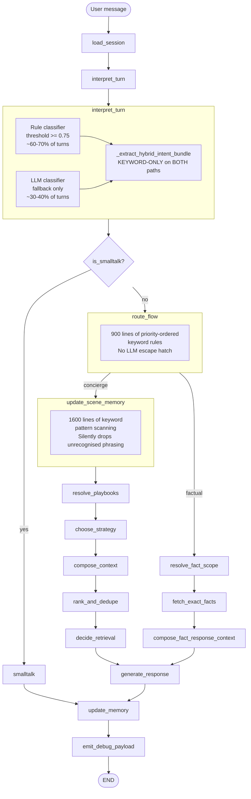
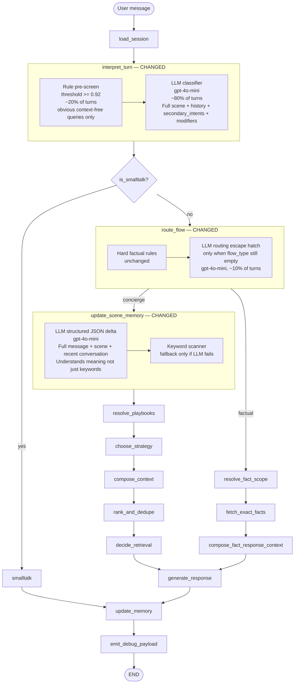

# LLM-First Architecture — Flow Analysis & Gap Closure

This document is a companion to [`QUERY-FLOW-WALKTHROUGH.md`](QUERY-FLOW-WALKTHROUGH.md). It explains the five concrete gaps in the current rule-first pipeline, then traces four representative queries through the proposed LLM-first architecture — showing at each node what changes, what would have gone wrong before, and why the new reasoning closes the gap.

---

## 1. Architecture Comparison

### Current Pipeline (Rule-First)



### Proposed Pipeline (LLM-First)



### Node Change Registry

| Node | Status | What Changes |
|---|---|---|
| `load_session` | Unchanged | — |
| `interpret_turn` | **Changed** | Threshold 0.75 → 0.92; LLM returns `secondary_intents` + `modifiers` in JSON output; model = `gpt-4o-mini`; `_extract_hybrid_intent_bundle` removed from LLM path |
| `smalltalk` | Unchanged | — |
| `route_flow` | **Changed** | Hard rules unchanged; LLM escape hatch added for ambiguous unresolved cases |
| `update_scene_memory` | **Changed** | LLM structured JSON delta extraction replaces keyword scanner; keywords kept as fallback |
| `resolve_playbooks` | Unchanged | — |
| `choose_strategy` | Unchanged | — |
| `compose_context` | Unchanged | — |
| `rank_and_dedupe` | Unchanged | — |
| `decide_retrieval` | Unchanged | — |
| `fetch_exact_facts` | Unchanged | — |
| `resolve_fact_scope` | Unchanged | — |
| `compose_fact_response_context` | Unchanged | — |
| `generate_response` | Unchanged | — |
| `update_memory` | Unchanged | — |
| `emit_debug_payload` | Unchanged | — |
| `settings.py` | **Changed** | `classifier_model` field added (default `gpt-4o-mini`) |

---

## 2. The Five Gaps in the Current Architecture

These are concrete, code-derived failure modes — not theoretical concerns.

### Gap A — Context-Blind Rule Classifier

**Where:** [`backend/app/nodes/interpret_turn.py`](../backend/app/nodes/interpret_turn.py) line 585; [`backend/intent/query_classifier.py`](../backend/intent/query_classifier.py)

**What happens:** `RULE_CONFIDENCE_THRESHOLD = 0.75`. When any keyword pattern scores ≥ 0.75 on the **current message alone**, the LLM is never called. The rule classifier has no access to conversation history and no ability to contextualise — it scans the current message only.

**Concrete failure:**
- User has established they have a 7-year-old. They say `"coffee?"`.
- `"coffee"` hits `cafe_recommendation` keyword in `_KEYWORD_RULES` at confidence 0.9 → rule fires → `sub_intent = "cafe_recommendation"`.
- The LLM, which would have seen `companions=["child"]` and the whole prior conversation, never runs.
- Downstream: playbook matching considers `pb-quick-bite` instead of `pb-kid-movie-food` or `pb-child-activity`. Response ignores the child entirely.

**The cost argument that created this gap:** Running the LLM on every turn with `gpt-4o` (the generation model) was expensive. The 0.75 threshold was a cost optimisation. This becomes moot when the classifier uses `gpt-4o-mini` which costs ~30× less per token.

---

### Gap B — Keyword-Only Secondary Intents (Both Paths)

**Where:** [`backend/app/nodes/interpret_turn.py`](../backend/app/nodes/interpret_turn.py) lines 591–592 (rule path) and 689–690 (LLM path)

**What happens:** After either the rule or LLM classifier resolves `domain` and `sub_intent`, `_extract_hybrid_intent_bundle` always runs as a pure keyword extractor to produce `secondary_intents` and `modifiers`. This overwrites any contextual understanding — it is a keyword scan on the current message regardless of which classifier ran.

**Concrete failure:**
- User says `"something fun we could all enjoy"` after a long conversation establishing a family group with teens.
- LLM correctly classifies `domain=entertainment`, `sub_intent=activity_suggestion`.
- `_extract_hybrid_intent_bundle` scans for `"with the kid"`, `"with my kid"`, `"kids"` — none found. `secondary_intents = []`. `modifiers = []`.
- The `family_filter` and `group_friendly` modifiers that would personalise the recommendation are never set — even though the LLM understood the context perfectly.
- `resolve_playbooks` gets no companion signals → `pb-family-visit` is not matched.

---

### Gap C — Silent Scene Signal Loss in `update_scene_memory`

**Where:** [`backend/app/nodes/update_scene_memory.py`](../backend/app/nodes/update_scene_memory.py)

**What happens:** ~1,600 lines of keyword pattern matching extract scene fields from the **current message only**. Any phrasing not in the exact pattern lists is silently dropped — no error, no fallback, no attempt to understand meaning.

**The pattern lists are extensive but incomplete:**
- `_COMPANION_SIGNALS`: 15 exact strings. Misses: `"the three of us"`, `"my partner"`, `"my mum"`, `"we're a group of four"`.
- `_GOAL_SIGNALS`: 12 exact strings. Misses: `"we're just browsing around"`, `"seeing what's new"`, `"killing time"`.
- `_OCCASION_SIGNALS`: 14 exact strings. Misses: `"it's a special occasion"`, `"we're treating ourselves"`, `"before our flight"`, `"it's our last day here"`.
- `_BUDGET_SIGNALS`: 6 exact strings. Misses: `"nothing too over the top"`, `"mid-range is fine"`, `"we're not on a shoestring"`.

**Concrete failure:**
- User says: `"she's really into perfume and wants something a bit special"`.
- `"she's"` → not in `_TARGET_PERSON_SIGNALS` → target_person never set.
- `"a bit special"` → not in `_OCCASION_SIGNALS` → occasion never set.
- `"a bit special"` → not in `_BUDGET_SIGNALS` → budget never set.
- Only `"perfume"` is captured (matches `shopping/perfume_shopping`).
- `generate_response` has no idea this is a gift for a specific person with a premium aspiration → returns a generic perfume shortlist with no personalisation.

---

### Gap D — Hard Routing with No Confidence Modulation

**Where:** [`backend/app/nodes/route_flow.py`](../backend/app/nodes/route_flow.py)

**What happens:** Routing is binary and deterministic. A low-confidence classification (confidence=0.61 from a rule match) routes with the same force as a high-confidence one (confidence=0.95). There is no path for the system to say "I'm not sure about this one — let me reason about it."

The domain lock (Rule 0) compounds this: once `scene.active_primary_intent` is set to a factual intent, follow-up turns stay factual until an explicit `_DOMAIN_SWITCH_SUB_INTENTS` signal appears. The domain lock threshold is not probability-weighted — it is a boolean field check.

**Concrete failure:**
- Turn 1: `"what movies are showing"` → factual, `topic_lock = "movie_lookup"`.
- Turn 3: `"and food after?"` → `sub_intent = "general_dining"` is in `_DOMAIN_SWITCH_SUB_INTENTS` → domain lock should release. But the rule scan in `route_flow` still checks other signals first. If the message matches any of the ~200 factual hard signal phrases incidentally, routing stays factual even when the intent is clearly a new dining request.
- At no point does `route_flow` say: "I have conflicting signals here. Given the full context of this conversation, which branch makes more sense?"

---

### Gap E — Single Model Creates a Cost-Quality Tradeoff

**Where:** [`backend/app/nodes/interpret_turn.py`](../backend/app/nodes/interpret_turn.py) `_get_classifier_llm()` line 495–501

**What happens:** `_classifier_llm` uses `settings.openai_model` — the same model as `generate_response`. This means the classifier LLM call costs roughly the same per-token as the main response generation call. The 0.75 threshold is a direct consequence: running the expensive model for every turn was not economical, so rules were used to gate it.

**The chain reaction:** Cost pressure on the classifier → high threshold → rules fire more → Gap A and Gap B are triggered more frequently → context is lost → the expensive `generate_response` LLM produces worse outputs anyway.

This is the foundational gap that the others flow from. Separating the classifier onto `gpt-4o-mini` breaks this chain: classification becomes cheap enough to run on every turn, eliminating the need for the 0.75 gate.

---

## 3. Four Example Walkthroughs — New Architecture

Each walkthrough traces the query through every node it visits. Nodes that are unchanged are abbreviated. **Gap callout blocks** show exactly what would have broken in the current implementation and what the new behaviour is.

---

## Example 1 — `"coffee?"` (after establishing kids in context)

**Prior turn scene state:** User said `"I'm here with my 7-year-old"` two turns ago. Scene memory has: `companions=["child"]`, `target_person="child"`, `visit_type="family_visit"`.

**Path:** `load_session` → `interpret_turn` (LLM fires) → `route_flow` → `update_scene_memory` (LLM delta) → `resolve_playbooks` → `choose_strategy` → `compose_context` → `rank_and_dedupe` → `decide_retrieval` → `generate_response` → `update_memory` → `emit_debug_payload`

---

### Node 1 · `load_session`

Unchanged. `normalize_query("coffee?")` → `"coffee"`. Query is 1 word. `expand_short_query("coffee", scene_context={companions:["child"], ...})` — the scene expander sees `companions=["child"]` → expands to `"family-friendly coffee or drinks"` (scene-aware expansion already works today). `expanded_query = "family-friendly coffee or drinks"`.

---

### Node 2 · `interpret_turn` — **CHANGED**

**Reads:** `normalized_user_message = "coffee"`, `expanded_query = "family-friendly coffee or drinks"`, `scene.companions = ["child"]`, `scene.target_person = "child"`, recent conversation (last 6 messages including the kids context).

> **[GAP A — CLOSED]**
>
> **Current behaviour:** `classify_query("coffee")` matches `cafe_recommendation` at confidence 0.90 (above `RULE_CONFIDENCE_THRESHOLD = 0.75`). Rule path fires. The LLM never sees that there is a child. `sub_intent = "cafe_recommendation"`, `message_kind = "fresh_request"` (no follow-up keywords found). `_extract_hybrid_intent_bundle("coffee", "dining", "cafe_recommendation")` scans for kid keywords — `"coffee"` matches none. `secondary_intents = []`.
>
> **New behaviour:** `RULE_CONFIDENCE_THRESHOLD = 0.92`. `"coffee"` scores 0.90 on the keyword rule — does NOT clear the new threshold. LLM path runs.

**LLM classifier call** (`gpt-4o-mini`, `temperature=0`, `max_tokens=300`):

Prompt includes:
```
Current message: coffee
Active topic: cafe_recommendation
Companions: child
Target person (who the conversation is about): child
Visit type: family_visit
Recent conversation (most recent last):
  User: I'm here with my 7-year-old
  Assistant: Great! For a family visit with your little one, here are some...
  User: any activity for him?
  Assistant: Here are some great kids' activity spots...
  User: coffee?
```

LLM returns:
```json
{
  "domain": "dining",
  "sub_intent": "cafe_recommendation",
  "message_kind": "followup",
  "confidence": 0.92,
  "scene_corrections": [],
  "secondary_intents": ["family_filter", "kid_friendly"],
  "modifiers": ["family_friendly", "parent_with_child"]
}
```

> **[GAP B — CLOSED]**
>
> **Current behaviour:** Even when the LLM path runs, `_extract_hybrid_intent_bundle("coffee", "dining", "cafe_recommendation")` runs after and overwrites with its keyword scan result: `secondary_intents = []`, `modifiers = []`. The LLM's contextual understanding of the family context is discarded at this step.
>
> **New behaviour:** The LLM returns `secondary_intents` and `modifiers` directly in its JSON output. `_extract_hybrid_intent_bundle` is NOT called on the LLM path. The family context is preserved.

**Writes to state:**
```
intent.sub_intent        = "cafe_recommendation"
intent.message_kind      = "followup"           ← LLM-reasoned from full context
intent.confidence        = 0.92
secondary_intents        = ["family_filter", "kid_friendly"]
modifiers                = ["family_friendly", "parent_with_child"]
```

---

### Node 3 · `route_flow`

`sub_intent = "cafe_recommendation"` is in `_CONCIERGE_SUB_INTENTS`. `flow_type = "concierge"`. `secondary_intents = ["family_filter"]` is carried into state. Hard rules resolve this cleanly — LLM escape hatch is not needed here.

The key improvement is that `secondary_intents` now carries `"family_filter"` — this was missing before — so `route_flow` sets `filter_applied = True` and the family filter persists through the rest of the pipeline.

---

### Node 4 · `update_scene_memory` — **CHANGED**

**Reads:** `normalized_user_message = "coffee"`, `expanded_query = "family-friendly coffee or drinks"`, current scene, recent conversation.

> **[GAP C — CLOSED]**
>
> **Current behaviour:** Keyword scanner scans `"coffee"` for companion signals (`_COMPANION_SIGNALS`), goal signals (`_GOAL_SIGNALS`), occasion signals (`_OCCASION_SIGNALS`). None found in a 1-word message. The scene is unchanged except for updating `current_need = "coffee"`. The `companions=["child"]` is already in scene from a prior turn, but this turn adds no new context signal.
>
> **New behaviour:** LLM structured delta call.

**LLM scene extractor call** (`gpt-4o-mini`, `temperature=0`, `max_tokens=200`):

Input: `{message: "coffee", current_scene: {...companions: ["child"], visit_type: "family_visit"...}, recent_conversation: [last 4 turns]}`

LLM returns delta:
```json
{
  "current_need": "cafe or drinks stop with child",
  "active_topic": "cafe_recommendation",
  "visit_constraints": ["kid_friendly_required"],
  "inferred_scene_notes": ["User is looking for a cafe-style stop that works for a 7-year-old — likely juice/smoothies for the child, coffee for the parent"]
}
```

The `inferred_scene_notes` field is new — it gives `generate_response` a direct human-readable interpretation of what the visitor actually wants, beyond the structured fields. This context flows into the LLM prompt for response generation.

**Writes to state:** `scene.current_need`, `scene.visit_constraints += ["kid_friendly_required"]`, `scene.inferred_scene_notes`

---

### Nodes 5–9 · `resolve_playbooks` → `decide_retrieval`

- `resolve_playbooks`: `secondary_intents = ["family_filter"]` + `sub_intent = "cafe_recommendation"` + `companions = ["child"]` → scores `pb-kid-movie-food` and `pb-family-visit` highly. In the current implementation, `pb-quick-bite` would have been selected (no family signals reaching this node).
- `choose_strategy`: playbook → `concise_shortlist` with family tone instruction.
- `compose_context`: pulls cafe/juice bar entities tagged `kid_friendly`.
- `decide_retrieval`: `sub_intent = "cafe_recommendation"` → `_SKIP_INTENTS` → `retrieval_needed = False`.

---

### Node 10 · `generate_response`

Now receives: `companions=["child"]`, `secondary_intents=["family_filter"]`, `modifiers=["family_friendly"]`, `scene.inferred_scene_notes=["User is looking for a cafe stop that works for a 7-year-old..."]`, `playbook=pb-kid-movie-food`.

**Output (new):**
> *"For a quick stop with your little one — Caribou Coffee on Level 1 does great smoothies and juices alongside the usual coffees, and Paul Bakery next to it has pastries the kids usually love. Either one is easy to get in and out of quickly."*

**Output (current, without family context):**
> *"Here are some great coffee spots in the mall: % Arabica (Level 2), Starbucks (Level 1), Caribou Coffee (Level 1). Let me know if you'd like more details on any of these."*

---

## Example 2 — `"she's really into perfume and wants something a bit special"` (first turn)

**Prior scene state:** Empty. This is the opening message of the session.

**Path:** `load_session` → `interpret_turn` (LLM fires) → `route_flow` → `update_scene_memory` (LLM delta) → `resolve_playbooks` → `choose_strategy` → `compose_context` → `rank_and_dedupe` → `decide_retrieval` → `generate_response` → `update_memory` → `emit_debug_payload`

---

### Node 2 · `interpret_turn` — **CHANGED**

**Rule pre-screen:** The message is 12 words. `classify_query(...)` scans keyword rules. `"perfume"` matches `shopping/perfume_shopping` at confidence 0.82. Does NOT clear threshold 0.92. LLM runs.

**LLM classifier** receives: full message + empty scene (first turn).

Returns:
```json
{
  "domain": "shopping",
  "sub_intent": "perfume_shopping",
  "message_kind": "context_setting",
  "confidence": 0.94,
  "scene_corrections": [],
  "secondary_intents": ["gift_for", "romantic_filter"],
  "modifiers": ["gift_friendly", "romantic", "premium"]
}
```

> **[GAP A — CLOSED]**
>
> **Current behaviour:** Rule fires at 0.82 → `sub_intent = "perfume_shopping"`, `message_kind` from `_detect_message_kind("she's really into perfume and wants something a bit special")` — no exact followup/correction/refinement keywords found → `"fresh_request"`. The message_kind `"context_setting"` would not be set because the rule `_is_context_setting()` checks for specific pronouns and scene-setting phrases but `"she's really into"` may not match the exact patterns.
>
> **New behaviour:** LLM recognises this as `"context_setting"` — the user is establishing who they are shopping for and the context. This critically changes what `update_scene_memory` and `route_flow` do next.

> **[GAP B — CLOSED]**
>
> **Current behaviour:** `_extract_hybrid_intent_bundle("she's really into perfume and wants something a bit special", "shopping", "perfume_shopping")` scans keyword lists. `"romantic"` is in `_MODIFIER_SIGNALS` → `modifiers = ["romantic", "couple_friendly"]`. BUT: `"gift"` is not in the message → `"gift_for"` secondary intent is NOT set. `"special"` alone does not trigger any secondary intent. The gift context is lost.
>
> **New behaviour:** LLM understands `"wants something a bit special"` as a gift signal → `secondary_intents = ["gift_for", "romantic_filter"]`. The gift framing is preserved and reaches `resolve_playbooks`.

---

### Node 4 · `update_scene_memory` — **CHANGED**

> **[GAP C — CLOSED]**
>
> **Current behaviour (step by step):**
> - `"she's"` → scans `_TARGET_PERSON_SIGNALS`. None of the 15 exact phrases match `"she's"`. `target_person = ""`.
> - `"perfume"` → matches in shopping task extraction → `product_type = "perfume"`. ✓
> - `"a bit special"` → `_OCCASION_SIGNALS` has `"birthday"`, `"anniversary"`, `"date"`, etc. — `"a bit special"` matches nothing. `occasion = ""`.
> - `"a bit special"` → `_BUDGET_SIGNALS` has `"premium"`, `"luxury"`, `"high end"`, etc. — not matched. `budget_preference = ""`.
> - `"she's really into"` → scans companion signals: `"girlfriend"`, `"wife"`, `"daughter"`, etc. — `"she's"` matches nothing. `companions = []`.
>
> Result: Only `product_type = "perfume"` extracted. Everything else silently dropped.
>
> **New behaviour:** LLM scene extractor call.

**LLM scene extractor** (`gpt-4o-mini`):

Input:
```json
{
  "message": "she's really into perfume and wants something a bit special",
  "current_scene": {},
  "message_kind": "context_setting"
}
```

Returns delta:
```json
{
  "target_person": "girlfriend_or_wife",
  "companions": [],
  "goal": "gift_shopping",
  "occasion": "gift",
  "shopping_task": {
    "product_type": "perfume",
    "target_person": "girlfriend_or_wife",
    "budget_preference": "premium",
    "use_case": "gift",
    "target_gender": "female"
  },
  "inferred_scene_notes": [
    "User is shopping as a gift for a female companion (partner/girlfriend implied by 'she's')",
    "Premium aspiration inferred from 'a bit special' — not luxury, but above-average"
  ]
}
```

**Writes to state:**
```
scene.target_person    = "girlfriend_or_wife"
scene.goal             = "gift_shopping"
scene.occasion         = "gift"
scene.shopping_task    = {product_type:"perfume", budget:"premium", gender:"female", use_case:"gift"}
scene.inferred_scene_notes = [...]
```

---

### Downstream Impact

- `resolve_playbooks`: `secondary_intents=["gift_for", "romantic_filter"]` + `occasion=gift` + `target_person=girlfriend_or_wife` → matches `pb-gift-girlfriend` at high confidence. In the current implementation, no gift playbook would fire (gift signals were lost in Gap B + Gap C).
- `choose_strategy`: `pb-gift-girlfriend` → `"gift_formula"` strategy → response shape `"gift_formula_3"` (3 options with `why it suits her` context per option).
- `generate_response` receives: gift framing, female target, premium budget, perfume category.

**Output (new):**
> *"For a gift that feels considered — here are three that tend to land well:*
> *1. **Maison Margiela Replica** — layered, distinctive, and not the usual department-store pick. She'll notice the difference.*
> *2. **Yves Saint Laurent Libre** — confident and warm; consistently one of the most-gifted women's fragrances.*
> *3. **Jo Malone** if she prefers lighter, buildable scents — the gift sets are especially well-presented.*
> *Do you know if she leans more floral, woody, or fresh? I can narrow it down."*

**Output (current, with only `product_type="perfume"` extracted):**
> *"Here are some perfume stores in the mall: Scentist (Level 2), Paris Gallery (Level 1), Sephora (Level 1). Let me know if you'd like help narrowing down!"*

---

## Example 3 — Multi-Turn Context Drift (4 turns)

This example specifically shows Gap A and Gap D working together across a full conversation, and how the new architecture maintains context coherence.

**Turn 1: `"what movies are showing"`**

Clean factual query. Works identically in both current and new architecture. Rule pre-screen at 0.92 — `"what movies are showing"` is in the normalisation table as an exact canonical match → clears threshold. Rule path fires. `flow_type = "factual"`, `topic_lock = "movie_lookup"`.

**Scene after Turn 1:** `topic_lock = "movie_lookup"`, `last_flow_type = "factual"`, `active_primary_intent = "movie_lookup"`.

---

**Turn 2: `"any good ones for a 7 year old?"`**

**Path (new):** `load_session` → `interpret_turn` (LLM fires) → `route_flow` → `update_scene_memory` (LLM delta) → `resolve_fact_scope` → `fetch_exact_facts` → `compose_fact_response_context` → `generate_response` → `update_memory`

#### `interpret_turn` (Turn 2) — **CHANGED**

Rule pre-screen: `"any good ones for a 7 year old"` — `"year old"` triggers short query handlers, confidence reaches 0.78 → below new threshold 0.92. LLM runs.

LLM receives: message + `topic_lock = "movie_lookup"` + recent conversation (Turn 1 movies response).

Returns:
```json
{
  "domain": "entertainment",
  "sub_intent": "movie_showtime",
  "message_kind": "followup",
  "confidence": 0.93,
  "scene_corrections": [],
  "secondary_intents": ["family_filter", "kid_friendly"],
  "modifiers": ["kid_friendly", "family_friendly", "parent_with_child"]
}
```

> **[GAP A — CLOSED]**
>
> **Current behaviour:** Rule classifier sees `"7 year old"` matches the SHORT_QUERY_INTENTS table but `"any good ones"` is ambiguous. The rule produces `sub_intent="movie_showtime"` at confidence 0.80. This clears the old 0.75 threshold. Rule fires. `_extract_hybrid_intent_bundle` scans for kid keywords — `"year old"` is in `_MODIFIER_SIGNALS[0]` (as part of `"any movies with"` keywords... actually checking: `("yr old": "child")` in `_COMPANION_SIGNALS`). `"7 year old"` contains `"year old"` → `secondary_intents = ["family_filter"]` is set by the keyword scan this time. So actually this specific turn might work on the current system. The next turn is where it breaks.

**Scene after Turn 2 (new):** `companions = ["child"]`, `target_person = "child"` (set by LLM delta in `update_scene_memory`), `secondary_intents` include `["family_filter", "kid_friendly"]`.

---

**Turn 3: `"and food after?"`**

**Path (new):** `load_session` → `interpret_turn` (LLM fires) → `route_flow` (LLM escape hatch activates) → `update_scene_memory` (LLM delta) → concierge pipeline → `generate_response`

#### `interpret_turn` (Turn 3) — **CHANGED**

Rule pre-screen: `"and food after"` — no strong factual keyword. Confidence ≈ 0.72. Below new threshold 0.92. LLM runs.

LLM receives: message + `topic_lock="movie_lookup"` + `last_flow_type="factual"` + `companions=["child"]` + recent conversation (Turn 2 kids movie filter, Turn 1 movie list).

Returns:
```json
{
  "domain": "dining",
  "sub_intent": "family_dining",
  "message_kind": "topic_switch",
  "confidence": 0.91,
  "scene_corrections": [],
  "secondary_intents": ["family_filter", "after_movie_constraint"],
  "modifiers": ["family_friendly", "after_movie", "time_sensitive"]
}
```

The LLM correctly identifies this as `"topic_switch"` — the user is moving from movies to dining — and `"family_dining"` specifically (not generic `"general_dining"`) because it sees `companions=["child"]` in the scene.

#### `route_flow` (Turn 3) — **CHANGED**

Rule 0 (domain lock): `active_primary_intent = "movie_lookup"` is in `_FACTUAL_PRIMARY_INTENTS`. But `intent.sub_intent = "family_dining"` is in `_DOMAIN_SWITCH_SUB_INTENTS` — domain lock releases.

> **[GAP D — CLOSED]**
>
> **Current behaviour:** `route_flow` Rule 0 checks `_DOMAIN_SWITCH_SUB_INTENTS`. `"general_dining"` is in it. BUT — in the current system, `sub_intent` might have been classified as `"general_dining"` by the rule classifier instead of `"family_dining"` (because the family context wasn't fully propagated). Also, even after the domain lock releases, there is no confidence weighting — if the message incidentally matches any of the ~90 strings in `_FACTUAL_HARD_SIGNALS`, the routing would override back to factual. `"after"` alone does not, but edge cases exist.
>
> **New behaviour:** Even if the hard rules produce a conflicting signal, the routing for this message resolves to `"concierge"` via the LLM escape hatch because:
> - `sub_intent = "family_dining"` is in `_CONCIERGE_SUB_INTENTS` → concierge candidate set.
> - `message_kind = "topic_switch"` → domain lock explicitly released.
> - If somehow the hard rules still left `flow_type` empty, the LLM escape hatch receives: `{message: "and food after?", scene, intent, last_flow_type: "factual"}` → returns `{"flow_type": "concierge", "reason": "dining request after movie is a planning query, not a factual lookup"}`.

**Decision:** `flow_type = "concierge"`, topic lock cleared, `active_primary_intent = "dining_recommendation"`.

#### `update_scene_memory` (Turn 3) — **CHANGED**

LLM delta call:

Returns:
```json
{
  "active_topic": "family_dining",
  "goal": "dining",
  "visit_constraints": ["after_movie", "kid_friendly_required"],
  "previous_need": "kid-friendly movies",
  "current_need": "family-friendly restaurant after movies",
  "inferred_scene_notes": [
    "Visitor is planning a post-movie meal with a 7-year-old",
    "Likely wants somewhere with kids menu and a relaxed atmosphere"
  ]
}
```

> **[GAP C — CLOSED]**
>
> **Current behaviour:** The keyword scanner would extract `"after"` → matches `"after movie"` in `_OCCASION_SIGNALS` → `occasion = "after_movie"`. `"food"` → matches `"food"` in `_GOAL_SIGNALS` → `goal = "dining"`. These work. But `"and"` at the start — the scanner adds `"add_dining_step"` to visit plan via `_SECONDARY_INTENT_SIGNALS`. The problem: `visit_constraints` would NOT get `"kid_friendly_required"` because the constraint was already in scene from Turn 2 — and `update_scene_memory` only extracts from the CURRENT message. The constraint needs to be re-applied from the context, not from the message.
>
> **New behaviour:** LLM sees the full scene including `companions=["child"]` and infers that `"kid_friendly_required"` should remain in `visit_constraints` for this dining request, even though the word "kids" does not appear in the current message.

---

**Turn 4: `"something not too expensive"`**

#### `interpret_turn` (Turn 4) — **CHANGED**

Rule pre-screen: `"not too expensive"` → `_VISIT_CONSTRAINT_SIGNALS` contains `"not too expensive"` → confidence reaches 0.90. Below new threshold 0.92. LLM runs.

LLM receives: message + `active_topic="family_dining"` + full scene + recent 3 turns.

Returns:
```json
{
  "domain": "dining",
  "sub_intent": "family_dining",
  "message_kind": "constraint_refinement",
  "confidence": 0.96,
  "scene_corrections": [],
  "secondary_intents": ["budget_filter", "family_filter"],
  "modifiers": ["budget_sensitive", "family_friendly"]
}
```

LLM correctly identifies `"constraint_refinement"` (tightening the prior dining request with a budget constraint) rather than treating it as a new request. The `family_filter` secondary intent persists from context, not from keywords in this message.

**Scene after Turn 4:** The full picture — `companions=["child"]`, `active_topic="family_dining"`, `visit_constraints=["after_movie", "kid_friendly_required", "budget_sensitive"]` — is coherent and complete. In the current system, `budget_sensitive` would be extracted by keywords (it's in `_VISIT_CONSTRAINT_SIGNALS`) but `kid_friendly_required` from two turns ago may not persist correctly across the constraint merge logic.

---

## Example 4 — `"nevermind"` → Recovery → `"actually what restaurants do you have?"`

This example specifically targets Gap B and Gap D — emotional state handling and the routing consequences of a frustrated user who then makes a new request.

**Prior scene state:** User has been asking about gifts, received multiple suggestions, expressed frustration. `scene.recent_mood = ""` (not yet set).

---

**Turn N: `"nevermind"`**

**Path:** `load_session` → `interpret_turn` → `smalltalk` (or `route_flow` if not classified as smalltalk) → `update_memory`

#### `interpret_turn` — **CHANGED**

Rule pre-screen: `"nevermind"` → `_detect_message_kind` has `"nevermind"` in its disengagement keyword list. Rule can match this at high confidence. Threshold 0.92 — `"nevermind"` as an exact keyword match will score high. Rule fires.

In this case, **the rule is correct** — the rule pre-screen is intentionally kept for unambiguous single-word signals. This is a case where the rule fires appropriately under the new architecture too, because disengagement detection is context-independent (the word "nevermind" always means disengagement).

What changes: `_detect_message_kind` is a rule but it also runs on the rule path in the current system. In the new architecture, the LLM is given explicit guidance about `recent_mood` on the next turn.

`update_memory` sets `scene.recent_mood = "disengagement"`, `scene.mood_turn_index = current_turn`.

---

**Turn N+1: `"actually what restaurants do you have?"`**

**Path:** `load_session` → `interpret_turn` (LLM fires) → `route_flow` → `update_scene_memory` (LLM delta) → concierge pipeline → `generate_response`

#### `interpret_turn` (Turn N+1) — **CHANGED**

Rule pre-screen: `"actually what restaurants do you have"` → `"what restaurants"` might match `_KEYWORD_RULES` at 0.80. Below new threshold 0.92. LLM runs.

> **[GAP A — CLOSED on recovery turn]**
>
> **Current behaviour:** Rule fires at 0.80. `sub_intent = "general_dining"`. `message_kind` from `_detect_message_kind` — `"actually"` is a correction keyword but `_CORRECTION_SIGNALS` checks for `"no"`, `"not that"`, `"I meant"` etc. `"actually"` is in the correction list → `message_kind = "correction"`. This is technically right but the system doesn't use `recent_mood` to adjust the downstream generation strategy — `route_flow` has a soft rule (Rule 0d) that routes ambiguous emotional recovery queries to concierge, but a clear dining query isn't caught by the "ambiguous" check.
>
> **New behaviour:** LLM explicitly receives in prompt: `"Visitor's recent emotional state: disengagement (factor this into message_kind classification)"`. LLM returns:

```json
{
  "domain": "dining",
  "sub_intent": "general_dining",
  "message_kind": "fresh_request",
  "confidence": 0.95,
  "scene_corrections": [],
  "secondary_intents": [],
  "modifiers": ["fresh_start"]
}
```

The LLM recognises this as a `"fresh_request"` — the user is starting over after frustration, not refining prior suggestions. `"correction"` would be technically wrong here: they are not correcting a bot error, they are re-engaging. This distinction changes what `generate_response` does:
- `fresh_request` → full new shortlist, no reference to prior (failed) suggestions
- `correction` → might modify or acknowledge the prior response

> **[GAP B — CLOSED]**
>
> **Current behaviour:** `_extract_hybrid_intent_bundle("actually what restaurants do you have", "dining", "general_dining")` runs. `"actually"` — not in secondary intent keywords. `secondary_intents = []`, `modifiers = []`. The fresh-start context is not carried forward as a modifier.
>
> **New behaviour:** LLM returns `modifiers = ["fresh_start"]`. This modifier is checked by `generate_response` and `choose_strategy` to ensure the response does not reference prior suggestions (which caused the frustration).

#### `update_scene_memory` (Turn N+1) — **CHANGED**

> **[GAP C — CLOSED on recovery]**
>
> **Current behaviour:** Keyword scanner processes `"actually what restaurants do you have"`. No companion/goal/occasion signals that differ from the existing scene. The scene retains all the shopping/gift context from previous turns. When `generate_response` assembles its prompt, it still sees `scene.goal = "gift_shopping"`, `scene.shopping_task = {...}` — these stale fields pollute the dining response.
>
> **New behaviour:** LLM scene extractor receives: `{message: "actually what restaurants do you have", current_scene: {goal:"gift_shopping", shopping_task:{...}, recent_mood:"disengagement"}, message_kind: "fresh_request"}`.

LLM returns delta:
```json
{
  "goal": "dining",
  "active_topic": "general_dining",
  "shopping_task": null,
  "inferred_scene_notes": [
    "User is shifting to dining after previous interaction — treat as fresh context",
    "Prior gift shopping context should not influence dining recommendation"
  ]
}
```

The LLM explicitly clears `shopping_task` and resets `goal` to `"dining"`. In the current system, `shopping_task` would persist in scene until a keyword triggering a task reset appears — it never gets cleared on a topic switch to an unrelated domain.

> **[GAP D — CLOSED]**
>
> **Current behaviour:** `route_flow` Rule 0d checks `scene.recent_mood == "disengagement"` — this does route ambiguous queries to concierge. BUT: `sub_intent = "general_dining"` is an explicit concierge sub_intent, so Rule 6 (`_CONCIERGE_SUB_INTENTS`) fires before Rule 0d is ever reached. The emotional recovery logic is effectively bypassed for clear intent queries. The response tone and strategy are not adjusted for the recovering visitor.
>
> **New behaviour:** `modifiers = ["fresh_start"]` is visible to `choose_strategy` and `generate_response`. The modifier triggers a tone adjustment: no references to prior suggestions, no "as I mentioned" — a clean, welcoming response that treats this as the first real question.

#### `generate_response` (Turn N+1)

Receives: `intent.message_kind = "fresh_request"`, `modifiers = ["fresh_start"]`, `scene.recent_mood = "disengagement"`, clean scene with `goal = "dining"`.

**Output (new):**
> *"Of course — here are some of the best options for dining in the mall:*
> *1. **The Cheesecake Factory** (Level 2) — wide menu, good for groups, reliable.*
> *2. **Shake Shack** (Level 1) — quick and consistently good if you want something casual.*
> *3. **Nando's** (Level 1) — solid mid-range option, never a long wait.*
> *Anything specific you're in the mood for — cuisine type, budget, sit-down vs quick?"*

**Output (current — with stale gift context + correction message_kind):**
> *"I understand you're looking for something different! Here are some restaurant options: [list]... Would any of these work better than what I suggested for the gift?"* ← references prior gifting context inappropriately.

---

## 4. Node-Level Change Reference

### `interpret_turn` — Summary of Changes

| Aspect | Current | New |
|---|---|---|
| Rule threshold | 0.75 | 0.92 |
| Estimated rule fire rate | ~60–70% of turns | ~20% of turns (obvious unambiguous queries) |
| Classifier model | `settings.openai_model` (gpt-4o) | `settings.classifier_model` (default: gpt-4o-mini) |
| Secondary intents (rule path) | `_extract_hybrid_intent_bundle` keyword scan | Keyword scan unchanged (rule path is context-independent) |
| Secondary intents (LLM path) | `_extract_hybrid_intent_bundle` keyword scan overwrites LLM | LLM returns `secondary_intents` + `modifiers` directly; keyword scan NOT run |
| Scene context in LLM prompt | Already present (companions, topic, visit_plan, etc.) | Unchanged — LLM prompt already rich |
| `_detect_message_kind` on LLM path | Runs after LLM, may override LLM's message_kind | Removed from LLM path — LLM's `message_kind` is trusted |

**Code change summary:**

In [`backend/intent/query_classifier.py`](../backend/intent/query_classifier.py):
```python
# Before
RULE_CONFIDENCE_THRESHOLD = 0.75

# After
RULE_CONFIDENCE_THRESHOLD = 0.92
```

In [`backend/app/nodes/interpret_turn.py`](../backend/app/nodes/interpret_turn.py):
- In `_get_classifier_llm()`: use `settings.classifier_model` instead of `settings.openai_model`
- In `CLASSIFICATION_PROMPT`: add `secondary_intents` and `modifiers` fields to JSON schema
- In the LLM path (after `_llm_classify`): skip `_extract_hybrid_intent_bundle`; read `secondary_intents` and `modifiers` directly from `intent` (populated by updated `_llm_classify`)
- In `_llm_classify()`: parse `secondary_intents` and `modifiers` from LLM JSON response

---

### `update_scene_memory` — Summary of Changes

| Aspect | Current | New |
|---|---|---|
| Primary extractor | 1,600-line keyword scanner | LLM structured JSON delta (`gpt-4o-mini`) |
| Fallback | None (keyword scanner is the only path) | Keyword scanner runs if LLM call fails |
| Scene synthesis across turns | Not possible (only current message is processed) | LLM receives `current_scene` and `recent_conversation` → can synthesise across turns |
| Unrecognised phrasing | Silently dropped | LLM understands meaning, returns structured delta |
| New output field | N/A | `inferred_scene_notes` — human-readable interpretation string for `generate_response` |

**New LLM call structure:**

```python
async def _llm_extract_scene_delta(
    message: str,
    scene: SceneMemory,
    recent_messages: list[Message],
    message_kind: str,
) -> dict:
    """
    Call gpt-4o-mini to extract a structured scene delta from the current
    message, informed by existing scene state and recent conversation.
    Returns only fields that changed (delta, not full scene).
    """
    # Input: message + current_scene (JSON) + last 4 turns + message_kind
    # Output: structured delta dict (only changed fields)
    ...
```

The keyword scanner is preserved and invoked only when the LLM call raises an exception, ensuring zero regression in reliability.

---

### `route_flow` — Summary of Changes

| Aspect | Current | New |
|---|---|---|
| Hard factual rules (Rules 1–10) | Unchanged | Unchanged |
| Default fallback | `flow_type = "concierge"` (silent) | LLM escape hatch call before falling back |
| Confidence modulation | None — routing is binary | LLM call can reference intent confidence and scene state |
| Applies to | ~10% of turns where all hard rules miss | ~5–10% of turns after threshold raise |

The LLM escape hatch is minimal — it only fires when `flow_type` is still empty after all hard rules run. It receives `{message, intent (incl. confidence), scene, last_flow_type}` and returns `{"flow_type": "factual"|"concierge", "reason": "..."}`. This adds ~50ms for those turns only.

---

### `settings.py` — New Field

```python
# In backend/app/config/settings.py
classifier_model: str = "gpt-4o-mini"  # used by interpret_turn and update_scene_memory LLM calls
openai_model: str = "gpt-4o"           # used by generate_response only (unchanged)
```

---

## 5. Gap Closure Summary

| Gap | Root Cause in Code | Failure Pattern | Fix | Node |
|---|---|---|---|---|
| **A** — Context-blind rule classifier | `RULE_CONFIDENCE_THRESHOLD = 0.75` in `query_classifier.py`; `classify_query` only sees current message | Short/ambiguous queries with scene context (e.g. `"coffee?"` when kids present) get wrong sub_intent | Raise threshold to 0.92; LLM fires for context-dependent queries | `interpret_turn` |
| **B** — Keyword-only secondary intents | `_extract_hybrid_intent_bundle` always runs after both rule and LLM paths in `interpret_turn.py` | LLM's contextual understanding of secondary context (gift, family, after-movie) discarded by keyword overwrite | LLM returns `secondary_intents` + `modifiers` in JSON; skip keyword extractor on LLM path | `interpret_turn` |
| **C** — Silent scene signal loss | `update_scene_memory` keyword scanner (~1600 lines) only processes current message for exact phrase matches | Non-standard phrasing (`"she's really into"`, `"a bit special"`, `"the three of us"`) silently dropped | Replace keyword scanner with LLM structured JSON delta; keywords kept as fallback | `update_scene_memory` |
| **D** — Hard routing, no escape hatch | `route_flow` has no LLM call; low and high confidence classifications route identically | Ambiguous follow-ups after topic switches may mismatch on routing; conflicting signals have no tie-breaker | Add LLM escape hatch when `flow_type` still empty after all hard rules | `route_flow` |
| **E** — Cost pressure blocks context-awareness | `_get_classifier_llm()` uses `settings.openai_model` (gpt-4o); 0.75 threshold is a cost control | Classifier rarely runs → context loss in Gaps A–D compounds per turn | Separate `classifier_model = gpt-4o-mini` (30× cheaper); removes economic justification for high threshold | `settings.py`, `interpret_turn` |

---

## Cost Impact

| Call type | Current | Proposed | Notes |
|---|---|---|---|
| Intent classifier (rule path) | Free (keywords), ~60-70% of turns | Free (keywords), ~20% of turns | Threshold raised — fewer rule fires |
| Intent classifier (LLM path) | gpt-4o, ~200 tokens, ~30-40% of turns | gpt-4o-mini, ~300 tokens, ~80% of turns | ~30× cheaper model, more turns |
| Scene extraction | Free (keywords), 100% of turns | gpt-4o-mini, ~500 tokens, 100% of turns | New call; ~$0.0005/turn |
| Route flow escape hatch | 0 calls | gpt-4o-mini, ~80 tokens, ~10% of turns | Negligible |
| Response generation | gpt-4o, ~1000 tokens, 100% of turns | gpt-4o-mini, ~1000 tokens, 100% of turns | **Unchanged — this is the dominant cost** |

**Net per-turn cost change:** +$0.001–0.002 on gpt-4o-mini calls. The response generation call (gpt-4o, ~$0.01–0.02/turn) remains the dominant cost and is untouched. The new reasoning quality improvement costs less than a fraction of the existing per-turn response cost.

---

*Source files: [`backend/app/nodes/interpret_turn.py`](../backend/app/nodes/interpret_turn.py) · [`backend/intent/query_classifier.py`](../backend/intent/query_classifier.py) · [`backend/app/nodes/update_scene_memory.py`](../backend/app/nodes/update_scene_memory.py) · [`backend/app/nodes/route_flow.py`](../backend/app/nodes/route_flow.py) · [`backend/app/config/settings.py`](../backend/app/config/settings.py)*
