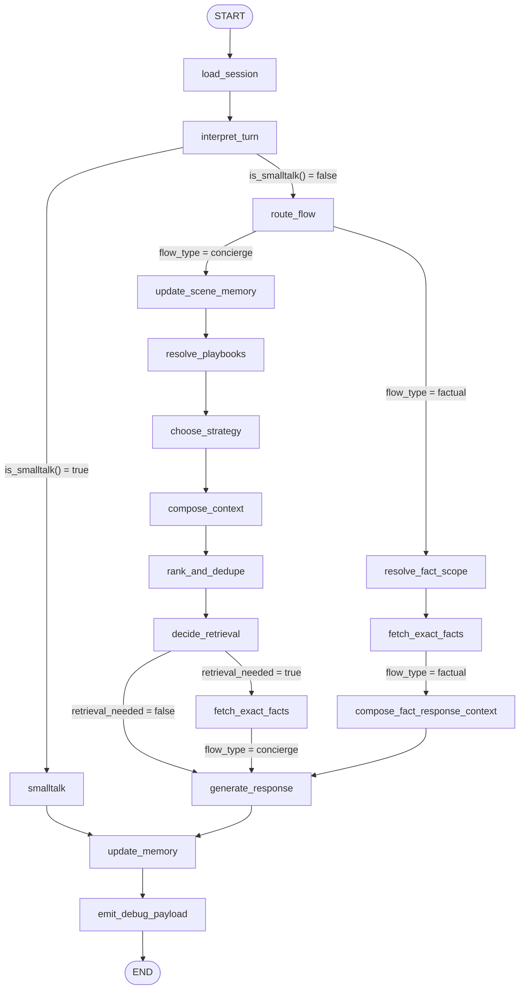

# Query Flow Walkthrough — How Reasoning Happens at Every Node

This document traces representative user queries through every node in the LangGraph pipeline. For each node the walkthrough explains exactly what data it reads from state, what reasoning or classification logic it applies, what decision it makes, and what it writes back — so you can follow the chain of intelligence from raw user message to final response.

---

## Graph Topology



> `fetch_exact_facts` is a shared node. After it completes, a conditional edge checks `flow_type` — factual turns continue to `compose_fact_response_context`; concierge turns go directly to `generate_response`.

---

## Intelligence Layer Stack

Every query passes through up to five distinct intelligence layers before a response is generated. Each layer narrows the problem space and hands off enriched context to the next.

| Layer | Implemented in | What it does |
|---|---|---|
| **1. Signal normalisation** | `load_session` + `query_classifier.normalize_query` | Strips noise, maps synonyms to canonical forms, expands short queries using scene context |
| **2. Intent classification** | `interpret_turn` (rule classifier → optional LLM fallback) | Assigns domain, sub_intent, message_kind, flow type hint, confidence |
| **3. Scene memory** | `update_scene_memory` + `update_memory` | Maintains persistent visitor profile across the entire session: companions, goal, occasion, topic lock, mood, visit plan |
| **4. Playbook + strategy selection** | `resolve_playbooks` + `choose_strategy` | Matches the classified intent + scene against scenario playbooks; selects the response strategy and shape |
| **5. Context assembly + retrieval gate** | `compose_context` + `rank_and_dedupe` + `decide_retrieval` | Pulls relevant mall entities, ranks and deduplicates them, then decides whether a live data lookup is needed |

The LLM (`generate_response`) only fires once — at the very end — grounded by everything these layers have prepared.

---

## Node Registry

| Node | Source file | Flow path | Purpose |
|---|---|---|---|
| `load_session` | `nodes/load_session.py` | All | Normalise message, expand short query, load tenant config |
| `interpret_turn` | `nodes/interpret_turn.py` | All | Classify intent; emit flow_type hint; detect message_kind |
| `smalltalk` | `nodes/smalltalk.py` | Smalltalk shortcut | Static regex-only responses for greetings/emotions |
| `route_flow` | `nodes/route_flow.py` | All (non-smalltalk) | Authoritative routing decision: concierge vs factual |
| `update_scene_memory` | `nodes/update_scene_memory.py` | Concierge | Compile visitor context into SceneMemory |
| `resolve_playbooks` | `nodes/resolve_playbooks.py` | Concierge | Match scene+intent to scenario playbooks |
| `choose_strategy` | `nodes/choose_strategy.py` | Concierge | Select response strategy and shape |
| `compose_context` | `nodes/compose_context.py` | Concierge | Pull and assemble entity/topic blocks from mall data |
| `rank_and_dedupe` | `nodes/rank_and_dedupe.py` | Concierge | Score, deduplicate, and cap entity list |
| `decide_retrieval` | `nodes/decide_retrieval.py` | Concierge | Gate: does this turn need a live data lookup? |
| `resolve_fact_scope` | `nodes/resolve_fact_scope.py` | Factual | Determine what exact fact is needed and extraction targets |
| `fetch_exact_facts` | `nodes/fetch_exact_facts.py` | Both | Execute targeted lookups (hours, movies, offers, locations) |
| `compose_fact_response_context` | `nodes/compose_fact_response_context.py` | Factual | Package raw results into a structured fact payload |
| `generate_response` | `nodes/generate_response.py` | All | LLM call with layered prompt, or static template |
| `update_memory` | `nodes/update_memory.py` | All | Persist turn outcomes to SceneMemory for next turn |
| `emit_debug_payload` | `nodes/emit_debug_payload.py` | All | Assemble debug summary, node trace, latency map |

---

## Example 1 — Greeting: `"Hi there!"`

**Path:** `load_session` → `interpret_turn` → `smalltalk` → `update_memory` → `emit_debug_payload`

This is the fastest possible path. The full concierge pipeline is bypassed entirely.

---

### Node 1 · `load_session`

**Reads from state:** `mall_id`, `raw_user_message`, `scene` (checked for existing context), `active_tenant_parameters`

**Reasoning:**
- Generates a new `turn_id` (UUID).
- Calls `normalize_query("Hi there!")` — removes punctuation, lowercases → `"hi there"`.
- Calls `expand_short_query("hi there", scene_context=None)` — the expansion map does not expand greetings (they are on a blocklist), so `expanded_query` stays `"hi there"`.
- Loads tenant configuration for the mall (language settings, feature flags, retrieval policy).
- Appends a `Message(role="user", content="hi there")` to the append-only `messages` list.

**Decision:** No branching logic. Always passes through to `interpret_turn`.

**Writes to state:** `turn_id`, `tenant_id`, `active_mall_id`, `active_tenant_parameters`, `normalized_user_message="hi there"`, `expanded_query="hi there"`, `messages` (user message appended)

---

### Node 2 · `interpret_turn`

**Reads from state:** `normalized_user_message`, `messages`, `scene`, `last_intent`, `conversation_mode`

**Reasoning:**
1. **Rule classifier path:** Calls `classify_query("hi there")`. "Hi there" is short (≤ 3 words) and matches the `SHORT_QUERY_INTENTS` table → mapped to `domain="general"`, `sub_intent="greeting"`.
2. **Confidence check:** Rule confidence is high (≥ 0.75 threshold), so no LLM fallback is triggered.
3. **Flow type hint:** `_detect_flow_type_candidate("hi there", "general", "greeting", scene_ctx)` — no factual or concierge keywords found → returns `("", "", "")` (no strong hint either way).
4. **Message kind:** The sub_intent "greeting" maps to `message_kind="greeting"`.
5. **Smalltalk check preparation:** The `InterpretedIntent` is written with `domain="general"`, `sub_intent="greeting"`, `message_kind="greeting"`.

**Decision:** The graph's conditional edge calls `is_smalltalk(state)`, which runs `classify_smalltalk("hi there")` using the `_GREETING_RE` regex. `"hi there"` matches `^(h(i|ey|ello...))` → returns `"greeting"` → `is_smalltalk()` returns `True`. **Route: → `smalltalk`**.

**Writes to state:** `intent` (InterpretedIntent with domain=general, sub_intent=greeting), `debug_enrichment` (interpretation contract)

---

### Node 3 · `smalltalk`

**Reads from state:** `normalized_user_message`, `raw_user_message`, `turn_id`, `scene.greeting_streak`

**Reasoning:**
- Calls `classify_smalltalk("hi there")` → `"greeting"` category.
- Checks `scene.greeting_streak`. On this first turn, `greeting_streak = 0` → selects a response from `_GREETING_FIRST` pool (4 warm welcome variations). Picks one at random, e.g.:
  > *"Hi there! Good to have you here. Whether you're after a meal, some shopping, a film, or you're just exploring — I can point you in the right direction. What are you in the mood for?"*
- No LLM call. No mall data lookup. Pure static response pool.
- Sets `experience_mode = "greeting_scaffold"`.
- Appends `Message(role="assistant", ...)` to `messages`.

**If `greeting_streak = 1`:** Would pick from `_GREETING_RETURNING` pool (mall layout hints, gentle nudge toward a request).
**If `greeting_streak ≥ 2`:** Would pick from `_GREETING_PERSISTENT` pool (asks them to state even one thing they want).

**Decision:** No branching. Always → `update_memory`.

**Writes to state:** `final_response_text`, `response_debug_summary = "smalltalk/greeting [greeting_scaffold]"`, `messages` (assistant message appended)

---

### Node 4 · `update_memory`

**Reads from state:** `scene`, `intent`, `response_debug_summary`, `flow_type`, `messages`

**Reasoning:**
- `response_debug_summary` starts with `"smalltalk/greeting"` → increments `scene.greeting_streak` from 0 to 1 and persists it.
- `current_flow = state.flow_type or "concierge"` — no flow_type was set (smalltalk bypasses route_flow) → records `scene.last_flow_type = "concierge"` as a safe default.
- `intent.message_kind = "greeting"` is not in `_EMOTIONAL_KINDS` → mood state unchanged.
- No topic lock change (no primary intent was set).

**Writes to state:** `scene` (greeting_streak=1), `last_successful_playbook` (unchanged), `preferred_categories` (unchanged)

---

### Node 5 · `emit_debug_payload`

Aggregates `node_trace` (each traced node's timing and summary), `latency_by_node`, and builds the developer-facing `response_debug_summary`. No user-visible output.

**Final state summary for this query:**

| Field | Value |
|---|---|
| `flow_type` | *(not set — smalltalk bypass)* |
| `final_response_text` | Warm welcome from `_GREETING_FIRST` pool |
| `scene.greeting_streak` | 1 |
| LLM calls | 0 |
| Nodes visited | 5 |

---

## Example 2 — Factual Query: `"What movies are showing today?"`

**Path:** `load_session` → `interpret_turn` → `route_flow` → `resolve_fact_scope` → `fetch_exact_facts` → `compose_fact_response_context` → `generate_response` → `update_memory` → `emit_debug_payload`

This is the factual branch: a specific piece of live data is needed, so the pipeline resolves the exact lookup scope and retrieves structured data before generating a response.

---

### Node 1 · `load_session`

**Reasoning:**
- `normalize_query("What movies are showing today?")` → `"what movies are showing today"` (lowercased, punctuation stripped).
- `expand_short_query(...)` — query is 5 words, not a short query, no expansion applied.
- Scene context is empty (first turn) so no scene-aware expansion.
- Appends user message, loads tenant config.

**Writes:** `normalized_user_message = "what movies are showing today"`, `turn_id`, `messages`

---

### Node 2 · `interpret_turn`

**Reads:** `normalized_user_message`, `scene` (empty), `last_intent` (none)

**Reasoning:**
1. **Rule classifier:** `classify_query("what movies are showing today")` — query is longer than 3 words, scans `_KEYWORD_RULES`. The phrase `"what movies"` matches a factual keyword rule → returns `domain="entertainment"`, `sub_intent="movie_showtime"`, confidence=0.9 (above 0.75 threshold).
2. **No LLM fallback needed** (confidence is high).
3. **Flow type hint:** `_detect_flow_type_candidate(...)` checks `sub_intent="movie_showtime"` → it is in `_FACTUAL_SUB_INTENTS` → looks up `_SUB_INTENT_SCOPE["movie_showtime"]` → returns `("factual", "movie_schedule", "movie")`.
4. **No concierge signals** detected (`has_concierge_signal = False`) so the factual hint stands.
5. **Message kind:** Fresh question, no prior history → `message_kind="fresh_request"`.
6. **Primary intent map:** `"entertainment/movie_showtime"` → `primary_intent="movie_lookup"`.

**Writes to state:**
```
intent.domain           = "entertainment"
intent.sub_intent       = "movie_showtime"
intent.message_kind     = "fresh_request"
intent.confidence       = 0.9
intent.flow_type_candidate        = "factual"
intent.fact_scope_candidate       = "movie_schedule"
intent.fact_entity_type_candidate = "movie"
primary_intent          = "movie_lookup"
```

**Decision:** `is_smalltalk("what movies are showing today")` → `_GREETING_RE`, `_HOWRU_RE`, etc. all fail → `False`. **Route: → `route_flow`**.

---

### Node 3 · `route_flow`

**Reads:** `intent`, `scene`, `normalized_user_message`, `dominant_context_type`

**Reasoning — priority-ordered rule scan:**
1. **Domain lock check:** No active domain lock in scene (`scene.topic_lock = ""`). Skip.
2. **Cross-mall check:** `intent.domain != "cross_mall"`. Skip.
3. **Explicit factual sub-intent check:** `intent.sub_intent = "movie_showtime"` is in `_FACTUAL_SUB_INTENTS`. → **Factual candidate established.**
4. **Concierge override check:** Scans message for `_CONCIERGE_KEYWORD_SIGNALS` — none present. No override.
5. **Hard factual keyword check:** `"what movies"` is in `_FACTUAL_HARD_SIGNALS`. Confirms factual.
6. **`intent.flow_type_candidate`:** Already `"factual"` — consistent signal.

**Decision:** All signals agree → `flow_type = "factual"`. Sets:
```
flow_type              = "factual"
flow_routing_reason    = "factual_sub_intent: movie_showtime"
retrieval_priority     = "exact"
primary_intent         = "movie_lookup"
```

**Graph conditional `_route_after_flow`:** `state.flow_type == "factual"` → **Route: → `resolve_fact_scope`** (right branch).

---

### Node 4 · `resolve_fact_scope`

**Reads:** `intent` (incl. `fact_scope_candidate = "movie_schedule"`), `normalized_user_message`

**Reasoning:**
- Starts with the hint from `interpret_turn`: `scope = "movie_schedule"`, `entity_type = "movie"`.
- Scans `_SCOPE_RULES` in priority order. The keyword tuple for the first rule includes `"movie"`, `"movies"`, `"now showing"`, `"what movies"` — the message `"what movies are showing today"` matches on `"what movies"` **and** `"movies"`. Rule: `scope="movie_schedule"`, `entity_type="movie"`, `response_mode="structured_fact_list"`. This confirms the hint.
- `_extract_entity_name(msg, "movie_schedule")` — tries regex patterns like `"where is X"`, `"do you have X"` — none match for a listing query → `query_entity = ""` (no specific film named).
- `_resolve_retrieval_targets("movie_schedule", "movie", msg)` → returns `["movie_schedule"]`.
- Creates `RetrievalDecision(retrieval_needed=True, reason="Factual flow: movie_schedule lookup requires exact data", targets=["movie_schedule"])`.

**Writes to state:**
```
fact_scope            = "movie_schedule"
fact_entity_type      = "movie"
fact_query_entity     = ""          (no specific title)
fact_response_mode    = "structured_fact_list"
retrieval             = RetrievalDecision(needed=True, targets=["movie_schedule"])
```

---

### Node 5 · `fetch_exact_facts`

**Reads:** `retrieval.retrieval_targets = ["movie_schedule"]`, `flow_type = "factual"`, `fact_query_entity = ""`

**Reasoning:**
- Target is `"movie_schedule"`. Calls `mall_ctx.get_movie_schedule()` (or equivalent) — a synchronous lookup against the mall's cinema data store for the active mall (`al_nakheel_plaza_28` or the session mall).
- `fact_query_entity` is empty → returns the **full** movie schedule (all currently showing films), not a specific title lookup.
- Each movie record includes: `title`, `genre`, `rating`, `duration_minutes`, `showtimes` (list of times), `formats_available` (2D/3D/IMAX).
- Results are stored in `retrieval.retrieval_results`.

**Conditional edge `_route_after_fetch`:** `state.flow_type == "factual"` → **Route: → `compose_fact_response_context`**.

**Writes to state:** `retrieval.retrieval_results` (list of movie data dicts)

---

### Node 6 · `compose_fact_response_context`

**Reads:** `retrieval.retrieval_results`, `fact_scope = "movie_schedule"`, `fact_entity_type = "movie"`, `fact_response_mode = "structured_fact_list"`, `secondary_intents`, `modifiers`

**Reasoning:**
- Iterates over `retrieval_results`. Each result with `data.type == "movie_schedule_all"` is unpacked → `fact_payload["movies"]` is populated with the full list.
- Each movie is also converted to an `extracted_entity` dict (`entity_type="movie"`, `name`, `genre`, `showtimes`, `duration_minutes`).
- `secondary_intents` and `modifiers` are empty (no companion/filter signals on this query) → no family or budget filter applied.
- `_FACTUAL_ENTITY_CAPS["structured_fact_list"] = 15` → caps entity list at 15 movies.
- `_SCOPE_STRATEGY["movie_schedule"] = "structured_fact_list"` → sets `response_plan.chosen_strategy = "structured_fact_list"`, `response_plan.response_shape_hint = "fact_list"`.
- Calls `resolve_response_mode(state)` → returns `"factual_list"` mode with high confidence.
- Sets `response_plan.fact_first = True`, `answer_mode = "direct_answer"`, `tone_mode = "structured"`.

**Writes to state:**
```
fact_context = {
  "scope": "movie_schedule",
  "movies": [...],        ← full cinema schedule
  "response_mode": "structured_fact_list",
  "retrieval_succeeded": True,
  "summary_notes": ["Found N movies in schedule"]
}
context = ContextComposition(
  selected_topic_blocks=["movie_schedule"],
  selected_entities=[...up to 15 movies...]
)
response_plan.chosen_strategy = "structured_fact_list"
response_plan.fact_first       = True
```

---

### Node 7 · `generate_response`

**Reads:** `fact_context`, `context`, `response_plan`, `intent`, `scene`, `messages` (full conversation history), `active_tenant_parameters`

**Reasoning:**
- `flow_type = "factual"` and `fact_context` is populated → enters the **`_build_factual_response`** path.
- `response_plan.chosen_strategy = "structured_fact_list"` → experience mode resolves to `FACTUAL_LIST`.
- The `ConciergeComposer` assembles a structured response: lists movies with title, genre, showtime slots, and format. No creative narrative — this is a data presentation.
- **Hallucination guard:** `validate_response(response_text, mall_ctx)` checks that every movie title mentioned exists in the mall's canonical data. Any title not in the verified set is stripped.
- Appends `Message(role="assistant", content=response_text)` to messages.

**Example output structure:**
> *"Here's what's currently showing at the cinema:*
> *1. **Dune: Part Two** — Action/Sci-Fi | Showtimes: 12:00, 15:30, 19:00, 22:15*
> *2. **Migration** — Animation | Showtimes: 11:00, 14:00, 17:00*
> *..."*

**Writes to state:** `final_response_text`, `response_debug_summary`, `messages` (assistant appended), `debug_enrichment.response_experience_mode = "factual_list"`

---

### Node 8 · `update_memory`

**Reasoning:**
- `scene.last_flow_type = "factual"` — persisted for next-turn follow-up resolution.
- `primary_intent = "movie_lookup"` is in `_LOCKABLE_INTENTS` → sets `scene.topic_lock = "movie_lookup"`, `scene.topic_lock_confidence = 0.8`.
- `scene.active_primary_intent = "movie_lookup"`.
- `active_secondary_filters` unchanged (none this turn).
- If user follows up with "anything with kids?" next turn, `topic_lock = "movie_lookup"` ensures the system knows we are still in movie territory.

**Writes to state:** `scene` (topic_lock=movie_lookup, last_flow_type=factual), `last_successful_playbook` (unchanged — factual flow does not use playbooks)

---

**Final state summary for this query:**

| Field | Value |
|---|---|
| `flow_type` | `factual` |
| `fact_scope` | `movie_schedule` |
| `retrieval_needed` | `True` |
| `scene.topic_lock` | `movie_lookup` (for follow-up continuity) |
| LLM calls | 1 (generate_response only) |
| Nodes visited | 9 |

---

## Example 3 — Concierge without Retrieval: `"I'm here with my wife for a date night, suggest a nice dinner"`

**Path:** `load_session` → `interpret_turn` → `route_flow` → `update_scene_memory` → `resolve_playbooks` → `choose_strategy` → `compose_context` → `rank_and_dedupe` → `decide_retrieval` → `generate_response` → `update_memory` → `emit_debug_payload`

This is the full concierge pipeline. Retrieval is skipped because the sub_intent is in `_SKIP_INTENTS` — the pre-loaded mall context is sufficient for a recommendation.

---

### Node 1 · `load_session`

**Reasoning:**
- `normalize_query(...)` → `"i'm here with my wife for a date night suggest a nice dinner"` (no significant changes).
- `expand_short_query(...)` — 13 words, not a short query, no expansion.
- No existing scene context (first turn).

**Writes:** `normalized_user_message`, `turn_id`, `messages`

---

### Node 2 · `interpret_turn`

**Reasoning:**
1. **Rule classifier:** Scans `_KEYWORD_RULES`. Detects `"suggest"` (from `_CONCIERGE_KEYWORD_SIGNALS`) and `"wife"` (companion signal). Sub_intent resolves to `"romantic_dining"` under domain `"dining"`. Confidence = 0.88.
2. **No LLM fallback** — confidence exceeds 0.75.
3. **Flow type hint:** `sub_intent="romantic_dining"` is NOT in `_FACTUAL_SUB_INTENTS`. Scans concierge signals — `"suggest"` and `"wife"` both present → `has_concierge_signal = True`. Returns `("concierge", "", "")`.
4. **Message kind detection:** New topic, full context provided → `"fresh_request"` (not a follow-up or refinement).
5. **Hybrid intent:** `"dining/romantic_dining"` → `primary_intent = "dining_recommendation"`. Companion token `"wife"` → `secondary_intents = ["romantic_filter"]`, `modifiers = ["romantic"]`.
6. **Scene correction detection:** Message contains `"with my wife"` → `scene_corrections = {"companions": "wife", "occasion": "date_night"}` set so `update_scene_memory` can act on them immediately.

**Writes to state:**
```
intent.domain           = "dining"
intent.sub_intent       = "romantic_dining"
intent.message_kind     = "fresh_request"
intent.confidence       = 0.88
intent.flow_type_candidate = "concierge"
intent.scene_corrections   = {"companions": "wife", "occasion": "date_night"}
primary_intent          = "dining_recommendation"
secondary_intents       = ["romantic_filter"]
modifiers               = ["romantic"]
```

**Decision:** `is_smalltalk(...)` → False. **Route: → `route_flow`**.

---

### Node 3 · `route_flow`

**Reasoning — priority scan:**
1. Domain lock: none. Skip.
2. Cross-mall: `domain = "dining"`. Skip.
3. Factual sub-intent check: `"romantic_dining"` is NOT in `_FACTUAL_SUB_INTENTS`. Skip.
4. Navigation domain: `domain = "dining"`. Skip.
5. Hard factual keyword signals: none in message. Skip.
6. **Strong concierge sub-intent check:** `"romantic_dining"` IS in `_CONCIERGE_SUB_INTENTS` → **Concierge candidate.**
7. Also: `"suggest"` and `"for her"` / `"wife"` are in `_CONCIERGE_HARD_SIGNALS` → concierge confirmed.
8. `_resolve_response_strategy(state)` → `response_strategy = "shortlist_recommendation"` (romantic dining maps to shortlist).

**Decision:**
```
flow_type           = "concierge"
flow_routing_reason = "concierge_sub_intent: romantic_dining"
retrieval_priority  = "semantic"
domain_locked       = False
response_strategy   = "shortlist_recommendation"
```

**Graph conditional `_route_after_flow`:** `flow_type != "factual"` → **Route: → `update_scene_memory`** (left branch).

---

### Node 4 · `update_scene_memory`

**Reads:** `intent` (incl. `scene_corrections`), `normalized_user_message`, `scene` (currently empty)

**Reasoning — scene compilation (not shallow key-value writing):**
1. **Companion extraction:** Scans message with `_COMPANION_SIGNALS` dict. `"wife"` matches → `scene.companions = ["wife"]`.
2. **Target person extraction:** `"my wife"` matches `_TARGET_PERSON_SIGNALS["for my wife"] = "wife"` → `scene.target_person = "wife"`.
3. **Occasion inference:** `"date night"` pattern detected → `scene.occasion = "date_night"`.
4. **Goal extraction:** `"suggest a nice dinner"` → `scene.goal = "dining"`.
5. **`scene_corrections` application:** `intent.scene_corrections = {"companions": "wife", "occasion": "date_night"}` — these strongly override any prior values (correction tokens have higher priority than inferred values).
6. **Shopping task:** No shopping signals → `scene.shopping_task` stays empty.
7. **Excluded domains:** No exclusions mentioned.
8. **Visit plan / sequential mode:** No sequential plan signals.

**Scene after this node:**
```python
scene.companions      = ["wife"]
scene.target_person   = "wife"
scene.occasion        = "date_night"
scene.goal            = "dining"
scene.active_topic    = "romantic_dining"
```

**Writes to state:** `scene` (enriched), `debug_enrichment` (scene compilation notes)

---

### Node 5 · `resolve_playbooks`

**Reads:** `intent`, `scene`, `flow_type = "concierge"`, `primary_intent`, `normalized_user_message`

**Reasoning:**
- `flow_type = "concierge"` → full playbook resolution runs (not suppressed).
- Checks `primary_intent = "dining_recommendation"` — not a factual primary intent, so `_FACTUAL_FLOW_BLOCKED_PLAYBOOKS` check is irrelevant.
- **`extract_semantic_signals(intent, scene)`** extracts: `["romantic", "dinner", "date_night", "wife"]`.
- **`mall_ctx.match_playbook(semantic_signals, scene, intent)`** scores all available playbooks. Scores the `"pb-romantic-dinner"` playbook highly: its triggers include `occasion=date_night`, `companion=wife/girlfriend`, `sub_intent=romantic_dining`.
- `"pb-gift-recommendation"` and `"pb-family-visit"` are both blocked by `_GIFT_ONLY_PLAYBOOKS` and family checks respectively.
- Playbook `"pb-romantic-dinner"` clears the `_CONFIDENCE_THRESHOLD = 0.25` with a score of ~0.82 → selected.

**Writes to state:**
```
playbook.matched_playbook_id  = "pb-romantic-dinner"
playbook.scenario             = "romantic_dinner"
playbook.confidence           = 0.82
playbook.topic_blocks         = ["fine_dining", "romantic_restaurants", "ambiance_focused"]
playbook.filters              = {"occasion": "date_night", "companions": ["wife"]}
```

---

### Node 6 · `choose_strategy`

**Reads:** `intent`, `scene`, `playbook`, `flow_type`, `response_strategy`, `active_tenant_parameters`

**Reasoning:**
- `flow_type = "concierge"` → normal strategy selection applies.
- Checks `_PLAYBOOK_STRATEGY_MAP["pb-romantic-dinner"]` → `"shortlist_recommendation"`.
- Double-checks with `_STRATEGY_RULES`: `sub_intent="romantic_dining"` is under rule index 4 (`shortlist_recommendation`) — consistent.
- **`resolve_response_mode(state)`** → resolves experience mode to `CURATED_SHORTLIST` (companion context present, romantic occasion, explicit suggestion request → curated experience).
- **`TenantRuntime.select_strategy(state)`** — checks tenant policy; no override configured → accepts `"shortlist_recommendation"`.
- `response_plan.response_shape_hint = "shortlist_3"` (3 restaurant recommendations with brief description each).
- `response_plan.must_acknowledge_scene = True` (companion context should be acknowledged in the opening).
- `response_plan.tone_mode = "warm"` (romantic occasion → warmer tone than informational).

**Writes to state:**
```
response_plan.chosen_strategy     = "shortlist_recommendation"
response_plan.response_shape_hint = "shortlist_3"
response_plan.answer_mode         = "curated"
response_plan.tone_mode           = "warm"
response_plan.must_acknowledge_scene = True
response_plan.response_mode       = "curated_shortlist"
response_plan.entity_cap          = 5
```

---

### Node 7 · `compose_context`

**Reads:** `intent`, `scene`, `playbook`, `response_plan`, `active_tenant_parameters`

**Reasoning:**
- `intent.sub_intent = "romantic_dining"` → checked against `_CATEGORY_LOOKUP_INTENTS` — `"general_dining"` is in the set but `"romantic_dining"` is not → falls through to **playbook-driven topic block assembly**.
- Loads playbook topic blocks: `["fine_dining", "romantic_restaurants", "ambiance_focused"]`.
- Queries mall context loader for tenants in these categories at the active mall. Returns restaurants tagged with `romantic`, `fine_dining`, or `ambiance_focused`.
- Builds `context.selected_entities` with restaurant records: `{name, category, floor, cuisine_type, tags, description}`.
- No cross-mall search triggered (query is for current mall only).
- No vector fallback needed (playbook topic blocks produced sufficient results).

**Writes to state:**
```
context.selected_topic_blocks    = ["fine_dining", "romantic_restaurants"]
context.selected_entities        = [... 8–12 restaurant candidates ...]
context.selected_semantic_signals = ["romantic", "date_night", "wife"]
context.candidate_count_before_dedupe = 12
```

---

### Node 8 · `rank_and_dedupe`

**Reads:** `context`, `intent`, `scene`, `playbook`, `response_plan`, `flow_type`

**Reasoning:**
- Iterates over `context.selected_entities` (12 restaurant candidates).
- **Deduplication:** Removes duplicate entity IDs.
- **Weighted scoring** for each entity:
  - `romantic` tag match → +0.3
  - `fine_dining` tag match → +0.25
  - `date_night` occasion alignment → +0.2
  - Playbook `pb-romantic-dinner` match → +0.15
  - General dining relevance → +0.1
- After scoring, sorts descending by score, applies `entity_cap = 5` from `response_plan`.
- Updates `context.ranking_notes` with scoring rationale.

**Writes to state:** `context` (entities re-ordered and capped at 5, ranking_notes added)

---

### Node 9 · `decide_retrieval`

**Reads:** `intent.sub_intent = "romantic_dining"`, `active_tenant_parameters`

**Reasoning:**
- Checks `sub_intent` against `_EXACT_INTENTS` — `"romantic_dining"` is **not** in this set.
- Checks against `_SKIP_INTENTS` — `"romantic_dining"` is **not** explicitly listed, but `"general_dining"` is. Falls to the else branch → `RetrievalDecision(retrieval_needed=False, reason="Default: no retrieval needed")`.
- `TenantRuntime.should_skip_retrieval("romantic_dining", is_vague=False)` — tenant policy confirms skip (recommendation query, context already loaded).

**Decision:** `retrieval_needed = False`. **Route: → `generate_response` (skips `fetch_exact_facts`)**.

**Writes to state:** `retrieval = RetrievalDecision(needed=False, reason="General recommendation — context-only")`

---

### Node 10 · `generate_response`

**Reads:** `intent`, `scene`, `playbook`, `response_plan`, `context` (5 ranked restaurants), `retrieval` (no results needed), `messages`, `active_tenant_parameters`

**Reasoning:**
- `flow_type = "concierge"` and `retrieval.retrieval_needed = False` → enters the main **concierge LLM path**.
- `resolve_experience(state)` → returns `CURATED_SHORTLIST` experience mode.
- **Prompt assembly:**
  1. `get_concierge_system_prompt(mall_ctx)` — role definition, mall grounding (mall name, location, tenant list, rules about not hallucinating brands)
  2. `_build_prior_messages(state)` — no prior turns (first turn) → empty
  3. Scene grounding block: `"Visitor context: with wife, occasion=date_night, goal=dining"` injected
  4. Playbook instruction: `"pb-romantic-dinner"` tone instructions → `"warm, intimate, present 2-3 options with ambiance context"`
  5. Retrieved entity block: 5 restaurants with names, cuisine, floor, tags
  6. Strategy instruction: `"shortlist_recommendation — give a brief curated shortlist with one sentence on why each fits the occasion"`
  7. CTA: call-to-action instruction for the response ending
  8. Current user message: `"I'm here with my wife for a date night, suggest a nice dinner"`
- **LLM call** (`ChatOpenAI`, `gpt-4o`, temperature=0.3, max_tokens=1024).
- **Hallucination guard:** `validate_response(response_text, mall_ctx)` — verifies every restaurant name mentioned is in the canonical tenant list. Any hallucinated name is stripped.

**Example output:**
> *"A date night calls for something special — here are a few options that set the right tone:*
>
> *1. **Côte Brasserie** (Level 1) — French classics in a warm, candlelit setting. Great for lingering over dinner.*
> *2. **Zuma** (Level 2) — Contemporary Japanese izakaya; sleek atmosphere and excellent for sharing plates.*
> *3. **Nobu** (Level 2) — World-renowned Japanese-Peruvian cuisine; ideal if you want something memorable.*
>
> *Any of these catching your eye, or would you like different cuisine?"*

**Writes to state:** `final_response_text`, `response_debug_summary`, `messages` (assistant appended), `debug_enrichment.response_experience_mode = "curated_shortlist"`

---

### Node 11 · `update_memory`

**Reasoning:**
- `scene.last_flow_type = "concierge"`.
- `scene.last_selected_playbook = "pb-romantic-dinner"`.
- `scene.last_response_experience_mode = "curated_shortlist"`.
- `primary_intent = "dining_recommendation"` → `scene.topic_lock = "dining_recommendation"`, confidence=0.8.
- `secondary_intents = ["romantic_filter"]` → merged into `scene.active_secondary_filters`.
- **Shortlist extraction:** Parses `final_response_text` for mentioned restaurant names → `scene.shortlists = ["Côte Brasserie", "Zuma", "Nobu"]`. These persist for follow-up turns ("tell me more about Nobu" will resolve correctly).
- `context_setting_turn` and `greeting_streak` unchanged.

**Writes to state:** `scene` (full update), `last_successful_playbook = "pb-romantic-dinner"`, `preferred_categories = ["dining"]`

---

**Final state summary for this query:**

| Field | Value |
|---|---|
| `flow_type` | `concierge` |
| `playbook` | `pb-romantic-dinner` |
| `response_strategy` | `shortlist_recommendation` |
| `retrieval_needed` | `False` |
| `scene.topic_lock` | `dining_recommendation` |
| `scene.shortlists` | `["Côte Brasserie", "Zuma", "Nobu"]` |
| LLM calls | 1 |
| Nodes visited | 12 |

---

## Example 4 — Multi-turn with Retrieval: `"What time does the mall open?"` → `"What about on Fridays?"`

This example shows two consecutive turns. The first is a pure factual lookup with retrieval; the second is a follow-up that demonstrates how `SceneMemory` carries context forward so the second turn does not need to re-interpret from scratch.

---

### Turn 1: `"What time does the mall open?"`

**Path:** `load_session` → `interpret_turn` → `route_flow` → `update_scene_memory` → `resolve_playbooks` → `choose_strategy` → `compose_context` → `rank_and_dedupe` → `decide_retrieval` → `fetch_exact_facts` → `generate_response` → `update_memory` → `emit_debug_payload`

*(Note: even on factual flow, `update_scene_memory` through `decide_retrieval` is part of the concierge branch. But wait — `route_flow` routes factual queries to `resolve_fact_scope`, not `update_scene_memory`. Let me clarify: the factual path skips `update_scene_memory` through `decide_retrieval`. The path is: `route_flow → resolve_fact_scope → fetch_exact_facts → compose_fact_response_context → generate_response`.)*

**Corrected path:** `load_session` → `interpret_turn` → `route_flow` → `resolve_fact_scope` → `fetch_exact_facts` → `compose_fact_response_context` → `generate_response` → `update_memory` → `emit_debug_payload`

---

#### Node 1 · `load_session`

- `normalize_query("What time does the mall open?")` → `"what time does the mall open"`.
- No scene context yet → no scene-aware expansion.
- Tenant config loaded, turn_id generated.

---

#### Node 2 · `interpret_turn`

**Reasoning:**
1. `classify_query("what time does the mall open")` — matches keyword rule `"what time does"` + `"mall"` → `domain="mall_info"`, `sub_intent="opening_hours"`, confidence=0.92.
2. `_detect_flow_type_candidate(...)`: `sub_intent="opening_hours"` is in `_FACTUAL_SUB_INTENTS` → maps via `_SUB_INTENT_SCOPE["opening_hours"]` → returns `("factual", "mall_fact", "mall")`.
3. No concierge signals in message → factual hint confirmed.
4. `message_kind = "fresh_request"`.
5. `primary_intent = "mall_fact_lookup"` (from `_PRIMARY_INTENT_MAP["mall_info/opening_hours"]`).

**Writes:**
```
intent.sub_intent              = "opening_hours"
intent.flow_type_candidate     = "factual"
intent.fact_scope_candidate    = "mall_fact"
intent.fact_entity_type_candidate = "mall"
primary_intent                 = "mall_fact_lookup"
```

---

#### Node 3 · `route_flow`

**Reasoning:**
- `sub_intent="opening_hours"` is in `_FACTUAL_SUB_INTENTS`.
- `"what time does"` and `"mall open"` are in `_FACTUAL_HARD_SIGNALS`.
- `domain="mall_info"` is in `_FACTUAL_DOMAINS`.
- All three independent checks agree on factual flow.

**Decision:** `flow_type = "factual"`, `flow_routing_reason = "factual_domain: mall_info + factual_sub_intent: opening_hours"`

**Route: → `resolve_fact_scope`**

---

#### Node 4 · `resolve_fact_scope`

**Reasoning:**
- Starts with hint `scope="mall_fact"`, `entity_type="mall"`.
- Scans `_SCOPE_RULES`. Rule for `("opening hours", "what time do you close", "what time does", ...)` matches → confirms `scope="mall_fact"`, `entity_type="mall"`, `response_mode="quick_answer"`.
- `_extract_entity_name(msg, "mall_fact")` — no specific entity name to extract (it's asking about the mall itself) → `query_entity = ""`.
- `_resolve_retrieval_targets("mall_fact", "mall", msg)` → `_MALL_FACT_RETRIEVAL["mall"] = ["entity_hours"]`.
- `RetrievalDecision(needed=True, targets=["entity_hours"])`.

**Writes:**
```
fact_scope         = "mall_fact"
fact_entity_type   = "mall"
fact_response_mode = "quick_answer"
retrieval          = RetrievalDecision(needed=True, targets=["entity_hours"])
```

---

#### Node 5 · `fetch_exact_facts`

**Reasoning:**
- Target `"entity_hours"` → calls `mall_ctx.get_mall_hours()` for the active mall.
- Returns: `{type: "mall_hours", operating_hours: {sunday-thursday: "10:00-22:00", friday-saturday: "10:00-23:00"}}`.
- Stores in `retrieval.retrieval_results`.

**Route: → `compose_fact_response_context`** (factual flow)

---

#### Node 6 · `compose_fact_response_context`

**Reasoning:**
- `data.type = "entity_hours"` → branch: `data.type == "mall_hours"` is True → `fact_payload["mall_hours"] = operating_hours dict`.
- `summary_notes = ["Mall hours retrieved"]`.
- `_SCOPE_STRATEGY["mall_fact"] = "quick_answer"` → `response_plan.chosen_strategy = "quick_answer"`, `response_shape_hint = "one_liner"`.
- `entity_cap = _FACTUAL_ENTITY_CAPS["quick_answer"] = 1`.
- `fact_first = True`, `answer_mode = "direct_answer"`.

**Writes:**
```
fact_context = {
  "scope": "mall_fact",
  "mall_hours": {"sunday-thursday": "10:00-22:00", "friday-saturday": "10:00-23:00"},
  "response_mode": "quick_answer",
  "retrieval_succeeded": True
}
response_plan.chosen_strategy = "quick_answer"
response_plan.response_shape_hint = "one_liner"
```

---

#### Node 7 · `generate_response`

**Reasoning:**
- `flow_type = "factual"`, `response_plan.chosen_strategy = "quick_answer"` → enters factual path.
- Experience mode resolves to `DIRECT_LOOKUP`.
- Prompt contains mall hours from `fact_context["mall_hours"]`.
- LLM generates a concise, direct answer from the data.

**Output:**
> *"The mall is open Sunday to Thursday from 10:00 AM to 10:00 PM, and Friday to Saturday from 10:00 AM to 11:00 PM."*

---

#### Node 8 · `update_memory` (Turn 1)

**Key actions:**
- `scene.last_flow_type = "factual"`.
- `primary_intent = "mall_fact_lookup"` → `scene.topic_lock = "mall_fact_lookup"`, `topic_lock_confidence = 0.8`.
- `scene.active_primary_intent = "mall_fact_lookup"`.
- `scene.active_fact_scope = "mall_fact"` (persisted for follow-up).
- `scene.last_context_setting_turn` unchanged.

After Turn 1, `scene` contains:
```python
scene.topic_lock             = "mall_fact_lookup"
scene.topic_lock_confidence  = 0.8
scene.last_flow_type         = "factual"
scene.active_primary_intent  = "mall_fact_lookup"
scene.active_fact_scope      = "mall_fact"
```

---

### Turn 2: `"What about on Fridays?"`

**Path:** `load_session` → `interpret_turn` → `route_flow` → `resolve_fact_scope` → `fetch_exact_facts` → `compose_fact_response_context` → `generate_response` → `update_memory` → `emit_debug_payload`

---

#### Node 1 · `load_session` (Turn 2)

- `normalize_query("What about on Fridays?")` → `"what about on fridays"`.
- **Scene context is populated**: `scene.active_topic = "mall_hours"`, `scene.topic_lock = "mall_fact_lookup"`, `scene.last_flow_type = "factual"`.
- `expand_short_query("what about on fridays", scene_context={...})` — the expander detects an anaphoric short query with active context. Checks `_EXPANSION_MAP` — `"what about"` with a factual follow-up → expanded to `"what are the mall opening hours on fridays"` (scene-aware expansion using `active_fact_scope = "mall_fact"`).

**Writes:** `normalized_user_message = "what about on fridays"`, `expanded_query = "what are the mall opening hours on fridays"`, turn_id, messages

---

#### Node 2 · `interpret_turn` (Turn 2)

**Reasoning:**
1. `classify_query("what about on fridays")` — 4 words, no strong keyword match. Returns low-confidence placeholder.
2. **Confidence = 0.4 < 0.75** → triggers **LLM fallback** (`_llm_classify`).
3. LLM is given the message `"what about on fridays"` plus:
   - The prior assistant message (mall hours response)
   - `scene.topic_lock = "mall_fact_lookup"`
   - `scene.last_flow_type = "factual"`
   - The `expanded_query = "what are the mall opening hours on fridays"`
4. LLM returns: `domain="mall_info"`, `sub_intent="opening_hours"`, `message_kind="followup"`, confidence=0.91.
5. **Message kind = `"followup"`** — this is the key signal that the topic has not changed, the user is just refining the same factual question.
6. `_detect_flow_type_candidate(...)`: `sub_intent="opening_hours"` → `("factual", "mall_fact", "mall")`.

**Writes:**
```
intent.sub_intent       = "opening_hours"
intent.message_kind     = "followup"     ← critical for continuity
intent.confidence       = 0.91
primary_intent          = "mall_fact_lookup"
```

---

#### Node 3 · `route_flow` (Turn 2)

**Reasoning:**
- **Rule 0 (Domain lock):** `scene.topic_lock = "mall_fact_lookup"` AND `scene.active_primary_intent = "mall_fact_lookup"` which is a factual primary intent → **domain lock active.** The rule says: if there is an active factual primary intent, enforce factual flow unless there is an explicit topic switch. `intent.message_kind = "followup"` is not a topic switch → factual flow enforced.
- `intent.sub_intent = "opening_hours"` independently confirms factual.
- `flow_routing_reason = "domain_lock: active_primary_intent=mall_fact_lookup is factual"`.

**Decision:** `flow_type = "factual"`. **Route: → `resolve_fact_scope`**.

The domain lock here is critical: even if the user's 4-word follow-up had been ambiguous, the scene memory would have locked the query to the right domain without needing re-classification.

---

#### Node 4 · `resolve_fact_scope` (Turn 2)

**Reasoning:**
- The message `"what about on fridays"` does not match the `("opening hours", "what time does the mall", ...)` keyword tuple directly — but the `expanded_query = "what are the mall opening hours on fridays"` is also checked (the node falls back to intent hints when the raw message is ambiguous).
- `intent.fact_scope_candidate = "mall_fact"` (set by `interpret_turn` from LLM output).
- `entity_type = "mall"`, `response_mode = "quick_answer"`.
- `query_entity = ""` — no named entity.
- The day qualifier `"fridays"` is noted in `summary_notes` but not treated as a separate entity — it will be handled by the LLM when generating from the retrieved schedule.
- `retrieval_targets = ["entity_hours"]`.

---

#### Node 5 · `fetch_exact_facts` (Turn 2)

- Same call as Turn 1: `mall_ctx.get_mall_hours()`.
- Same operating hours data returned.
- LLM in `generate_response` will extract the Friday-specific slice from the full hours dict.

---

#### Node 6 · `compose_fact_response_context` (Turn 2)

- Same logic as Turn 1 → `fact_payload["mall_hours"]` populated.
- `intent.message_kind = "followup"` noted in `summary_notes` so `generate_response` knows this is a narrowing question, not a new request.

---

#### Node 7 · `generate_response` (Turn 2)

**Reasoning:**
- Prompt now includes prior turn in `_build_prior_messages(state)`:
  - Prior human: `"what time does the mall open"`
  - Prior assistant: `"The mall is open Sunday to Thursday..."`
- Current human: `"what about on fridays"`
- `fact_context["mall_hours"]` available.
- LLM recognises the follow-up context and narrows its answer to Friday-Saturday hours.

**Output:**
> *"On Fridays (and Saturdays), the mall stays open a bit later — 10:00 AM to 11:00 PM."*

---

#### Node 8 · `update_memory` (Turn 2)

**Reasoning:**
- `intent.message_kind = "followup"` → `topic_lock_confidence` increased from 0.8 to 0.9 (follow-up strengthens existing lock per `update_memory` logic).
- `scene.topic_lock = "mall_fact_lookup"` unchanged (same topic reinforced).
- `scene.last_flow_type = "factual"` (same as Turn 1).

```python
scene.topic_lock_confidence = 0.9   # was 0.8
scene.last_flow_type        = "factual"
```

---

**Final state summary for this two-turn example:**

| Turn | `flow_type` | `message_kind` | Retrieval | `topic_lock` | LLM calls |
|---|---|---|---|---|---|
| Turn 1 | `factual` | `fresh_request` | Yes (`entity_hours`) | `mall_fact_lookup` (0.8) | 1 |
| Turn 2 | `factual` | `followup` | Yes (`entity_hours`) | `mall_fact_lookup` (0.9) | 1 (+ 1 for classifier) |

The LLM classifier fired in Turn 2 only because the raw message was ambiguous — this is the one scenario where `interpret_turn` uses the LLM as a fallback rather than pure rules. The domain lock in `route_flow` and the topic lock in `scene` acted as a safety net, ensuring correct routing even before the LLM classifier confirmed the intent.

---

## How the Intelligence Layers Contextualise the Bot

The four examples above illustrate individual paths, but the deeper story is how the intelligence layers work together across a session to make the bot progressively smarter about who it is talking to and what they need.

### Layer 1 — Signal Normalisation (`load_session`)

Before any reasoning happens, the raw message is cleaned:

- **`normalize_query`** maps synonyms to canonical forms (e.g. `"wats on"` → `"what is on"`, `"timings"` → `"hours"`). This means downstream classifiers do not need to handle every spelling variant.
- **`expand_short_query`** converts ambiguous short queries into full questions using the current scene. If a user says `"food"` after establishing they are with kids, the expander produces `"family-friendly restaurants"` — the scene has already been folded into the query before classification even begins.

### Layer 2 — Intent Classification (`interpret_turn`)

The classifier is a **two-tier hybrid**:

1. **Rule tier (zero cost):** A rule table of keyword patterns, each with a confidence score. If the highest-matching rule clears `RULE_CONFIDENCE_THRESHOLD = 0.75`, the LLM is never called.
2. **LLM tier (fallback only):** Short, ambiguous, or follow-up messages that score below 0.75 are passed to a lightweight `ChatOpenAI` call with conversation history injected. The LLM returns structured JSON (domain, sub_intent, message_kind, confidence).

Beyond just labelling the message, `interpret_turn` also emits:
- `flow_type_candidate` — an advisory hint for `route_flow`
- `scene_corrections` — extracted companion/occasion signals for `update_scene_memory` to act on immediately
- `secondary_intents` and `modifiers` — the hybrid intent bundle that persists into `update_memory` for multi-turn continuity

### Layer 3 — Scene Memory (`update_scene_memory` + `update_memory`)

`SceneMemory` is the bot's persistent model of the visitor across the entire session. It is not a log — it is a compiled profile that is continuously updated and used to ground every subsequent query.

Key fields and how they evolve:

| Field | Set by | Used by | Purpose |
|---|---|---|---|
| `companions` | `update_scene_memory` | `resolve_playbooks`, `generate_response` | Who the user is with |
| `occasion` | `update_scene_memory` | `resolve_playbooks`, `choose_strategy` | Why they are here |
| `goal` | `update_scene_memory` | `compose_context` | What they want to accomplish |
| `topic_lock` | `update_memory` | `route_flow` (Turn 2+) | Prevents topic drift on ambiguous follow-ups |
| `topic_lock_confidence` | `update_memory` | Routing priority weight | Strengthens on follow-up, resets on topic switch |
| `last_flow_type` | `update_memory` | `route_flow` | Follow-up inherits prior factual/concierge context |
| `shortlists` | `update_memory` | `generate_response` | Named entities from previous response, for "tell me more about X" |
| `greeting_streak` | `update_memory` | `smalltalk` | Adjusts greeting response tier across repeated hellos |
| `recent_mood` | `update_memory` | `interpret_turn`, `generate_response` | Records frustration/disengagement; expires after 2 turns |
| `excluded_domains` | `update_scene_memory` | `compose_context` | Filters out domains user has rejected ("not shopping") |

The `message_kind` field is the key signal that controls how `update_scene_memory` merges new data:

- **`fresh_request`** → full scene update from current message
- **`followup`** → inherit existing scene, only append new constraints
- **`refinement`** → update current_need, preserve companions/goal
- **`topic_switch`** → archive `active_topic` to `previous_topic`, reset shortlist, clear domain-specific filters but preserve audience filters (e.g. family_filter survives a topic switch from movies to food)
- **`correction`** → strong override via `scene_corrections` tokens

### Layer 4 — Playbook + Strategy Selection (`resolve_playbooks` + `choose_strategy`)

Playbooks are pre-defined scenario templates: `pb-romantic-dinner`, `pb-family-visit`, `pb-gift-girlfriend`, `pb-quick-errand`, etc. Each has a set of trigger conditions (occasion, companion type, sub_intent) and outputs a set of topic blocks and tone instructions.

The matching process:
1. `extract_semantic_signals(intent, scene)` builds a signal vector from the classified intent + compiled scene.
2. `mall_ctx.match_playbook(signals, scene, intent)` scores all active playbooks and returns the best match above `_CONFIDENCE_THRESHOLD = 0.25`.
3. Guard rules prevent inappropriate playbooks: `_FACTUAL_FLOW_BLOCKED_PLAYBOOKS` prevents shopping/gift playbooks from overriding factual lookups; `_GIFT_ONLY_PLAYBOOKS` prevents gift playbooks from firing on general activity queries.

`choose_strategy` then maps the playbook to a **response strategy** (e.g. `shortlist_recommendation`, `guided_plan`, `gift_formula`, `concise_shortlist`) and a **response shape** (e.g. `shortlist_3`, `mini_itinerary`, `yes_no_plus_location`). These become the primary instructions for `generate_response`.

### Layer 5 — Context Assembly and Retrieval Gate (`compose_context` + `rank_and_dedupe` + `decide_retrieval`)

Before the LLM fires, the context assembly layer pulls real mall data and decides how much of it to include:

1. **`compose_context`** selects entities from the mall's tenant catalogue using playbook topic blocks or deterministic category queries (for `general_dining`, `cafe_recommendation`, etc.). It also handles cross-mall brand searches when triggered.
2. **`rank_and_dedupe`** scores entities against the scene signals and playbook, deduplicates, and caps the list. The cap ensures the LLM prompt stays within token budget and the response stays focused.
3. **`decide_retrieval`** is the gate between pre-loaded context and live data lookup:
   - `_EXACT_INTENTS` (hours, showtimes, movies, locations, parking) → `retrieval_needed=True` → `fetch_exact_facts`
   - `_SKIP_INTENTS` (all recommendation/exploration sub-intents) → `retrieval_needed=False` → directly to `generate_response`
   - Tenant policy can override either direction via `TenantRuntime.should_skip_retrieval()`

### LLM Grounding Strategy (`generate_response`)

The LLM does not answer from training data alone. The final prompt is assembled in layers:

```
[1] System prompt        — mall identity, concierge role, anti-hallucination rules, 
                           tenant list (what brands exist and what don't)
[2] Prior conversation   — all previous HumanMessage/AIMessage pairs from session
[3] Scene grounding      — visitor context: companions, occasion, goal, shortlist
[4] Playbook instruction — scenario-specific tone and format guidance
[5] Entity block         — 3–5 ranked, real tenant records with name, floor, tags
[6] Strategy instruction — "give a shortlist of 3" / "direct answer" / "route hint"
[7] Fact payload         — (factual flow only) exact retrieved data
[8] CTA instruction      — how to end the response (question, direction, invitation)
[9] Current user message
```

The hallucination guard (`validate_response`) runs after generation and removes any brand or store name not in the mall's canonical tenant list — ensuring the response is grounded in real, verifiable data from the first token to the last.

---

*Source files: [`backend/app/graph/builder.py`](../backend/app/graph/builder.py) · [`backend/app/nodes/`](../backend/app/nodes/) · [`backend/app/models/state.py`](../backend/app/models/state.py) · [`backend/intent/query_classifier.py`](../backend/intent/query_classifier.py) · [`backend/llm/prompts/`](../backend/llm/prompts/)*
