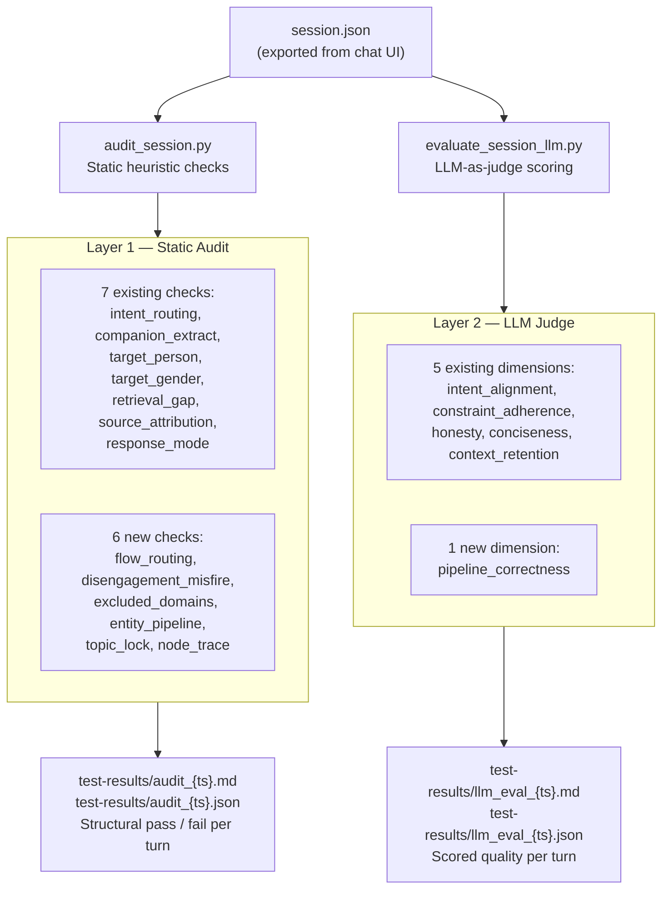

# Evaluation Methodology — Cenomi Concierge Pipeline

**Version:** v1.7  
**Last updated:** April 2026

This document is the definitive reference for how the Cenomi chatbot is evaluated. It covers both evaluation layers, every check and scoring dimension, the full debug data model, and guidance on interpreting results.

---

## Table of Contents

1. [Why Two Layers](#1-why-two-layers)
2. [Architecture Overview](#2-architecture-overview)
3. [Layer 1 — Static Audit](#3-layer-1--static-audit-audit_sessionpy)
4. [Layer 2 — LLM Judge](#4-layer-2--llm-judge-evaluate_session_llmpy)
5. [Debug Data Reference](#5-debug-data-reference)
6. [Node Trace Reference](#6-node-trace-reference)
7. [Running Both Tools Together](#7-running-both-tools-together)
8. [Interpreting Combined Results](#8-interpreting-combined-results)

---

## 1. Why Two Layers

Evaluating only the final response text answers *"did the bot say the right thing?"* but not *"did it say it for the right reasons?"*

A response can look correct even when the pipeline misfired internally — for example:

- The bot answered a food question correctly, but `excluded_domains` still contained `dining` (the pipeline worked *around* a stale exclusion bug)
- The response was helpful, but 69 irrelevant stores were passed to the LLM (entity bloat happened to not surface)
- The reply seemed coherent, but `generate_response` ran twice because of a duplicate graph edge

These failures are invisible to response-only evaluation. They become visible the moment a slightly different phrasing triggers the same bug more aggressively.

**The two-layer approach:**

| Layer | Tool | Cost | What it answers |
|-------|------|------|-----------------|
| Static audit | `audit_session.py` | Zero — no API calls | Did the pipeline behave correctly structurally? |
| LLM judge | `evaluate_session_llm.py` | ~$0.01–0.05 per session | How good was the quality of each response? |

Run the static audit first (always, on every session). Run the LLM judge when you need a quality score for reporting or regression comparison.

---

## 2. Architecture Overview



Both tools read from the same exported session file and write independent reports to `test-results/`. They are designed to complement each other: the audit shows **where** the pipeline went wrong; the LLM judge shows **how much** it affected output quality.

---

## 3. Layer 1 — Static Audit (`audit_session.py`)

### How to run

```bash
cd backend && source .venv/bin/activate

# Run on the default session (test_scenario.json at repo root)
python scripts/audit_session.py

# Run on a specific session file with custom output directory
python scripts/audit_session.py --session path/to/session.json --out test-results/
```

Output files are written to the `--out` directory:
- `audit_{timestamp}.md` — human-readable report with turn-by-turn issues
- `audit_{timestamp}.json` — machine-readable results for programmatic comparison

### Severity levels

| Severity | Meaning | Action |
|----------|---------|--------|
| `error` | Functional correctness failure — the pipeline produced a wrong output | Investigate immediately; likely a prompt or logic regression |
| `warning` | Potential issue — the pipeline signal is suspicious | Review the turn; may be acceptable given conversation context |
| `info` | Informational note — no correctness impact | Optional review; useful for performance tuning |

A turn **passes** the audit if it has zero `error` and zero `warning` issues. `info` items do not affect the pass/fail result.

### All 13 checks

#### Existing checks (7)

---

**`intent_routing`**
- **Signal:** `debug.intent_domain` vs keywords in the user message
- **What it checks:** Whether the classified intent domain is consistent with the vocabulary in the user's message. Uses a keyword table mapping domain terms (e.g. "eat", "food", "restaurant" → dining; "buy", "jacket", "shop" → shopping).
- **Flags:** Domain mismatch — e.g. classified as `general` when the message contains clear dining signals.
- **Severity:** `warning`
- **Limitation:** Keyword-based; will not catch subtle misroutes where no strong keyword is present. Cross-reference with the LLM judge's `intent_alignment` score for those cases.

---

**`companion_extract`**
- **Signal:** `debug.scene_summary.companions`
- **What it checks:** Whether companions mentioned explicitly in the *current* message appear in the scene companions list.
- **Flags:** Missing companion — e.g. user says "I'm with my girlfriend" but `companions` does not include `girlfriend`.
- **Severity:** `warning`
- **Note:** Does not flag companions from *earlier* turns that are absent from this message — carry-forward is intentional and correct.

---

**`target_person`**
- **Signal:** `debug.scene_summary.shopping_task.target_person`
- **What it checks:** Whether `target_person` is consistent with pronouns and relationship words in the user message ("for him", "for my son", "for my wife").
- **Flags:** Wrong target — e.g. user says "for my son" but `target_person = "boyfriend"`.
- **Severity:** `error`

---

**`target_gender`**
- **Signal:** `debug.scene_summary.shopping_task.target_gender`
- **What it checks:** Whether `target_gender` matches pronouns used in the user message.
- **Flags:** Gender mismatch — e.g. user uses "him/his" but `target_gender = "female"`.
- **Severity:** `error`

---

**`retrieval_gap`**
- **Signal:** `debug.retrieval_needed`, `debug.response_mode`
- **What it checks:** Whether retrieval was correctly triggered for recommendation-heavy responses. For `intent_domain` in `{shopping, dining, entertainment}` with `response_mode` in `{guided_recommendation, hybrid_plan, best_effort_shortlist}`, retrieval is generally expected.
- **Flags:** Retrieval skipped on a recommendation query — bot may be relying on parametric knowledge only.
- **Severity:** `warning`

---

**`source_attribution`**
- **Signal:** `debug.retrieval_needed`, `debug.retrieval_results_count`, `message.sources`
- **What it checks:** If retrieval fired and returned results, those results should be attributed as sources in the message.
- **Flags:** Retrieval fired with results but `message.sources` is empty — retrieved content was used but not attributed.
- **Severity:** `error`

---

**`response_mode`**
- **Signal:** `debug.message_kind`, `debug.intent_domain`, `debug.response_mode`
- **What it checks:** Whether `response_mode` is consistent with the `(message_kind, intent_domain)` combination using a lookup table of expected pairings.
- **Flags:** Mode inconsistency — e.g. `fresh_request + dining` expected `guided_recommendation` but got `context_acknowledgement`.
- **Severity:** `info`
- **Note:** Some pairings are legitimately flexible; this is a soft signal.

---

#### New checks (6)

---

**`flow_routing`**
- **Signal:** `debug.flow_type`
- **What it checks:** Whether the pipeline took the correct path (factual vs concierge) for the user's message.
  - Messages with factual keywords ("where is", "what time", "do you have [brand]", "is X here", "when does") → expect `flow_type = "factual"`
  - Recommendation phrasing ("suggest", "recommend", "what can I eat", "give me options") → expect `flow_type = "concierge"`
- **Flags:** Flow type mismatch — e.g. a "where is Herfy?" query routed as `concierge` instead of `factual`.
- **Severity:** `warning`
- **Why it matters:** Wrong flow type means the wrong retrieval path ran. A factual query that goes through the concierge path will miss the exact-fact lookup; a concierge query through the factual path will miss playbook selection and entity ranking.

---

**`disengagement_misfire`**
- **Signal:** `debug.message_kind`, `debug.intent_domain`
- **What it checks:** Whether `message_kind = "disengagement"` was assigned on a turn where the user was actually making an explicit request.
  - If `message_kind = "disengagement"` AND `intent_domain` is one of `{dining, shopping, entertainment, navigation, services}` → this is a misfire. The disengagement handler returns a canned recovery message instead of serving the request.
- **Flags:** Disengagement misfire — e.g. "I wanna eat junk food" classified as `disengagement/dining`.
- **Severity:** `error`
- **Why it matters:** This is the most severe UX failure the pipeline can produce. The user asked for something specific and received a generic recovery message instead.

---

**`excluded_domains`**
- **Signal:** `debug.scene_summary.excluded_domains`, `debug.intent_domain`
- **What it checks:** Two conditions:
  1. If `excluded_domains` is non-empty AND `intent_domain` matches one of the excluded domains AND `message_kind` is an actionable kind (`fresh_request`, `refinement`, `followup`, `topic_switch`) → user has re-engaged with an excluded domain; exclusion should have been cleared.
  2. If `excluded_domains` contains a domain that was not explicitly rejected by the user (e.g. `dining` excluded after asking about a food item rather than saying "no food") → spurious exclusion.
- **Flags:** Stale exclusion active during re-engagement, or spurious exclusion set without explicit user rejection.
- **Severity:** `warning`
- **Why it matters:** A spurious or stale `excluded_domains` entry silently removes all entities of that type from context, causing the bot to give recommendations with empty or wrong results.

---

**`entity_pipeline`**
- **Signal:** `debug.selected_entities` (list), `debug.scene_summary.shopping_task.product_type`, `debug.warnings`
- **What it checks:** Three sub-checks:
  1. **Entity bloat:** If `shopping_task.product_type` is set (specific product search) and `len(selected_entities) > 20` → too many entities were passed to the LLM; off-topic stores were not suppressed.
  2. **Domain mismatch:** If `intent_domain = "dining"` but the majority of `selected_entities` have non-dining `entity_type` → wrong entity pool selected.
  3. **Pipeline warnings:** If `debug.warnings` is non-empty → surface each warning item as an `info` issue so they appear in the audit report.
- **Flags:** Entity bloat (warning), domain mismatch (warning), pipeline warnings (info per item).
- **Severity:** `warning` / `info`
- **Why it matters:** Entity bloat wastes LLM context, increases latency, and causes the LLM to mention irrelevant stores. The 69-store blob observed in session turn 16 is exactly this pattern.

---

**`topic_lock`**
- **Signal:** `debug.message_kind`, `debug.scene_summary.topic_lock`, `debug.intent_domain`
- **What it checks:** If `message_kind = "topic_switch"` (user explicitly moved to a different domain) but `topic_lock` still reflects the *old* domain rather than the new `intent_domain` → the topic lock was not reset.
- **Flags:** Stale topic lock after topic switch.
- **Severity:** `warning`
- **Why it matters:** A stale `topic_lock` causes subsequent turns to inherit the wrong domain context. For example, if the user switches from dining to shopping and `topic_lock` stays on `dining_recommendation`, the next follow-up turn will be treated as a dining refinement rather than a shopping one.

---

**`node_trace`**
- **Signal:** `debug.node_trace` (list of `NodeTraceEntry`)
- **What it checks:** Four sub-checks:
  1. **Empty trace:** If `node_trace` is an empty list → the pipeline did not run normally; no node timing was captured. (`error`)
  2. **Duplicate nodes:** If any node name appears more than once in the trace → a node ran twice in a single turn, indicating a graph routing bug. (`error`, reports the duplicated node name)
  3. **Per-node warnings:** If any `NodeTraceEntry.warnings` list is non-empty → surface each warning as an `info` item attributed to that node.
  4. **Slow turn:** If `debug.total_latency_ms > 8000` → flag as `info` ("slow turn: {N}ms"). Threshold is indicative; adjust based on your SLA.
- **Severity:** `error` (empty/duplicate), `info` (warnings, latency)
- **Why it matters:** Duplicate nodes are the clearest signal of a graph topology bug (e.g. the `fetch_exact_facts → generate_response` double-edge fixed in April 2026). Slow turns can reveal which node is the bottleneck via `debug.latency_by_node`.

---

### Report format

The audit report has three sections:

1. **Summary table** — total turns, clean turns, turns with issues, counts by severity.
2. **Turn-by-turn audit** — for each turn: user message, intent, response mode, companions, retrieval status, and all issues found.
3. **Consolidated issues table** — all errors and warnings across all turns in a single flat table, sorted by turn index.

---

## 4. Layer 2 — LLM Judge (`evaluate_session_llm.py`)

### How to run

```bash
cd backend && source .venv/bin/activate

# Run on the default session (test_scenario.json at repo root)
python scripts/evaluate_session_llm.py

# Run with a specific session and model
python scripts/evaluate_session_llm.py --session path/to/session.json --model gpt-4.1-mini

# Run with GPT-4o for higher-quality scoring
python scripts/evaluate_session_llm.py --session path/to/session.json --model gpt-4o --out test-results/
```

Output files:
- `llm_eval_{timestamp}.md` — scored report with per-turn dimension breakdown
- `llm_eval_{timestamp}.json` — full data including scores, strengths, weaknesses, and verdict per turn

### All 6 dimensions

Each dimension is scored **1–5** (1 = very poor, 5 = excellent). The `overall_score` is the average of all 6 dimensions.

---

**`intent_alignment`** *(existing)*
- **What it measures:** Did the response directly address what the user asked in this turn?
- **Score 5:** On-topic, complete, nothing irrelevant included.
- **Score 3:** Partially addresses the intent but includes off-topic content or misses part of the request.
- **Score 1:** Answers a different question entirely; user intent ignored.
- **Common cause of low score:** Disengagement misfire; stale `excluded_domains` blocking relevant entities; wrong flow path.

---

**`constraint_adherence`** *(existing)*
- **What it measures:** Were all stated scene constraints respected — companions, budget, dietary preferences, time constraints?
- **Score 5:** Every constraint mentioned in the conversation (not just this turn) is reflected in the response.
- **Score 3:** Most constraints respected but one was missed or partially ignored.
- **Score 1:** A clearly stated constraint (e.g. "we have kids", "budget-friendly only") was ignored.
- **Common cause of low score:** `kid_friendly_required` not set; `budget` field not populated; companion context dropped mid-conversation.

---

**`honesty`** *(existing)*
- **What it measures:** Are all stores, prices, hours, and facts grounded in the mall's knowledge base? No hallucination.
- **Score 5:** Every entity mentioned is a real store at the mall; every fact is verifiable from KB context.
- **Score 3:** One minor fact is questionable but the overall recommendation is grounded.
- **Score 1:** Invented stores, fabricated menu items as brand anchors (e.g. "Cinnabon does tiramisu"), wrong floor/zone, non-existent services.
- **Common cause of low score:** Bot asked about a specific menu item ("can I get tiramisu?") and the LLM inferred it from brand fit rather than deferring.

---

**`conciseness`** *(existing)*
- **What it measures:** Is the response the right length with the right number of recommendations?
- **Score 5:** 2–4 well-chosen options with brief justifications; no padding; no repeated content.
- **Score 3:** Slightly too long or too short, but the useful content is present.
- **Score 1:** Bloated list of 8+ options with no differentiation, OR a one-line answer when detail was needed, OR duplicate paragraphs in the same response.
- **Common cause of low score:** Entity bloat (69-store context); no entity cap applied; `generate_response` called twice (duplicate response).

---

**`context_retention`** *(existing)*
- **What it measures:** Does the response correctly carry forward conversation context from earlier turns?
- **Score 5:** Scene details from turn 1 (companions, constraints, occasion) are naturally woven into the response on turn 8.
- **Score 3:** Some context carried forward; minor details dropped.
- **Score 1:** Bot appears to treat each turn as a new conversation; companions forgotten; constraints reset.
- **Common cause of low score:** Stale `topic_lock`; `excluded_domains` not cleared; `recent_mood` not expiring.

---

**`pipeline_correctness`** *(new)*
- **What it measures:** Did the internal pipeline take the right path, classify intent correctly, select relevant entities, and avoid structural failures?
- **Score 5:** `flow_type` matches query nature; `message_kind` correctly classified; entity list is relevant and appropriately sized (≤10 for specific tasks); no spurious exclusions; `node_trace` shows expected node sequence; no pipeline warnings.
- **Score 4:** Minor pipeline issue (e.g. slightly too many entities) that did not affect the response.
- **Score 3:** Noticeable pipeline signal is wrong (e.g. `topic_lock` not updated) but response quality was partially rescued.
- **Score 2:** Pipeline made a wrong routing or classification decision that clearly impacted response quality (e.g. wrong flow path, entity domain mismatch).
- **Score 1:** Severe pipeline failure: disengagement misfire on an explicit request, spurious domain exclusion blocking all relevant content, duplicate node execution causing duplicate response, or 60+ irrelevant entities passed to LLM.
- **Context provided to the judge:** `flow_type`, `chosen_strategy`, entity count and entity type summary, `excluded_domains`, `topic_lock`, pipeline warnings, `node_trace` summary (node names and latencies).

---

### Verdict thresholds

| Overall score | Verdict |
|---------------|---------|
| ≥ 4.0 | `pass` |
| 3.0 – 3.9 | `needs_improvement` |
| < 3.0 | `fail` |

### Report format

The LLM eval report has four sections:

1. **Overall scores table** — average score per dimension with a visual bar.
2. **Verdict summary** — count of pass / needs_improvement / fail / errors.
3. **Turn-by-turn score table** — one row per turn with all 6 dimension scores and verdict icon.
4. **Detailed turn analysis** — for each turn: intent + mode metadata, full score breakdown, strengths, weaknesses, and assistant response snippet.

---

## 5. Debug Data Reference

Every assistant turn in an exported session JSON contains a `debug` object. The fields below are available for both evaluation tools and for direct inspection.

| Field | Source node | Type | Meaning |
|-------|-------------|------|---------|
| `turn_id` | `emit_debug_payload` | string | Unique ID for this turn (`msg-{hex}`) |
| `session_id` | `emit_debug_payload` | string | Session this turn belongs to |
| `mall_id` | `emit_debug_payload` | string | Active mall context |
| `intent_domain` | `interpret_turn` | string | Classified domain: `dining`, `shopping`, `entertainment`, `navigation`, `services`, `exploration`, `mall_info`, `general`, `cross_mall` |
| `intent_sub` | `interpret_turn` | string | Sub-intent within domain (e.g. `quick_bite`, `general_shopping`, `location_query`) |
| `message_kind` | `interpret_turn` | string | Turn classification: `fresh_request`, `followup`, `refinement`, `constraint_refinement`, `topic_switch`, `acknowledgement`, `disengagement`, `emotional`, `category_negation`, `companion_correction`, `greeting`, `thanks`, `farewell`, `identity`, `crisis` |
| `intent_confidence` | `interpret_turn` | float | Classifier confidence 0.0–1.0 |
| `flow_type` | `route_flow` | string | Pipeline path taken: `factual`, `concierge`, or `smalltalk` (inferred from node_trace) |
| `chosen_strategy` | `choose_strategy` | string | Response strategy: `guided_plan`, `concise_shortlist`, `quick_answer`, `mini_itinerary`, `direct_fact`, `disengagement_recovery`, etc. |
| `response_shape` | `choose_strategy` | string | Layout hint passed to the LLM response generator |
| `selected_playbook` | `resolve_playbooks` | string | Active playbook ID (e.g. `pb-quick-lunch`, `pb-family-shopping`) |
| `playbook_confidence` | `resolve_playbooks` | float | Playbook match confidence |
| `matched_playbooks` | `resolve_playbooks` | list | All playbooks considered, in rank order |
| `selected_topic_blocks` | `compose_context` | list | Topic block names included in the LLM context window |
| `selected_entities` | `compose_context` + `rank_and_dedupe` | list | Full entity objects passed to `generate_response` |
| `selected_semantic_signals` | `compose_context` | list | Active semantic tags (e.g. `solo`, `family_friendly`) |
| `ranking_notes` | `compose_context` + `rank_and_dedupe` | list | Human-readable notes about how entities were ranked and why |
| `response_mode` | `choose_strategy` | string | How the response is shaped: `guided_recommendation`, `direct_factual`, `hybrid_plan`, `best_effort_shortlist`, `context_acknowledgement`, `graceful_recovery`, `clarification_request` |
| `confidence_level` | `choose_strategy` | string | `high`, `medium`, or `low` |
| `fallback_applied` | `choose_strategy` | bool | Whether the pipeline fell back to a lower-confidence strategy |
| `retrieval_needed` | `decide_retrieval` | bool | Whether `fetch_exact_facts` was called in this turn |
| `retrieval_results_count` | `fetch_exact_facts` | int | Number of factual results returned from the exact-fact lookup |
| `scene_summary` | `update_scene_memory` + `update_memory` | object | Full `SceneMemory` state after this turn — see sub-fields below |
| `warnings` | various nodes | list | Pipeline warnings accumulated across all nodes in this turn |
| `node_trace` | `@traced_node` decorator | list | Per-node execution record — see [Node Trace Reference](#6-node-trace-reference) |
| `latency_by_node` | `emit_debug_payload` | object | Dict of `node_name → latency_ms` for all traced nodes |
| `total_latency_ms` | `emit_debug_payload` | int | End-to-end turn latency in milliseconds |

### Key `scene_summary` sub-fields

| Sub-field | Meaning |
|-----------|---------|
| `companions` | List of companions present (e.g. `["girlfriend", "kids"]`) |
| `visit_type` | `solo`, `couple`, `family_visit`, `group` |
| `occasion` | `before_movie`, `date`, `birthday`, etc. |
| `budget` | `budget`, `mid_range`, `premium`, `luxury` |
| `visit_constraints` | Active constraints: `quick`, `kid_friendly_required`, `budget_sensitive`, etc. |
| `excluded_domains` | Domains the user has explicitly rejected: `dining`, `shopping`, `entertainment`, `cafe` |
| `topic_lock` | Current locked intent (e.g. `dining_recommendation`, `location_lookup`) |
| `topic_lock_confidence` | Confidence in the lock 0.0–1.0 |
| `active_topic` | Active domain for this turn |
| `active_primary_intent` | Full intent string (e.g. `dining_recommendation`) |
| `active_shortlist` | Last 5 entities surfaced to the user |
| `shopping_task` | Structured shopping task: `product_type`, `product_category`, `target_person`, `target_gender`, `budget_preference` |
| `recent_mood` | `disengagement` or `emotional` if the user was recently frustrated or emotional |
| `last_resolved_entity` | Entity name from the most recent factual lookup |
| `last_resolved_entity_type` | Entity type from the most recent factual lookup |

---

## 6. Node Trace Reference

`debug.node_trace` is a list of `NodeTraceEntry` objects, one per node that ran during the turn. Nodes are recorded in execution order.

### `NodeTraceEntry` fields

| Field | Type | Meaning |
|-------|------|---------|
| `node` | string | Node function name (e.g. `interpret_turn`, `generate_response`) |
| `started_at` | ISO string | When the node began executing |
| `ended_at` | ISO string | When the node finished executing |
| `latency_ms` | int | Time spent in this node (milliseconds) |
| `summary` | string | The `_trace_summary` string returned by the node — a human-readable description of what it did (e.g. `"intent=dining/quick_bite conf=0.90"`) |
| `output_keys` | list | State keys that were written by this node (e.g. `["intent", "expanded_query"]`) |
| `warnings` | list | `_trace_warnings` emitted by this node (e.g. `"Domain exclusion: removed 3 entities"`) |

### Expected node sequences

Use these to verify `flow_type` is consistent with which nodes actually ran.

**Concierge path** (recommendation, shopping, entertainment, exploration):
```
load_session
  → interpret_turn
  → route_flow
  → update_scene_memory
  → resolve_playbooks
  → choose_strategy
  → compose_context
  → rank_and_dedupe
  → decide_retrieval
  → [fetch_exact_facts]   ← only if retrieval_needed=true
  → generate_response
  → update_memory
  → emit_debug_payload
```

**Factual path** (location queries, store hours, movie showtimes, brand presence):
```
load_session
  → interpret_turn
  → route_flow
  → resolve_fact_scope
  → fetch_exact_facts
  → compose_fact_response_context
  → generate_response
  → update_memory
  → emit_debug_payload
```

**Smalltalk path** (greetings, thanks, farewell, emotional, identity, crisis):
```
load_session
  → interpret_turn
  → smalltalk
  → update_memory
  → emit_debug_payload
```

### Using `latency_by_node` for performance debugging

`debug.latency_by_node` maps node names to their latency in milliseconds. Typical budgets:

| Node | Expected | Investigate if |
|------|----------|----------------|
| `interpret_turn` | 300–800ms | > 1500ms |
| `update_scene_memory` | 400–900ms | > 1800ms |
| `generate_response` | 1000–3000ms | > 5000ms |
| `compose_context` | 50–200ms | > 500ms |
| `rank_and_dedupe` | 10–50ms | > 200ms |
| `fetch_exact_facts` | 100–400ms | > 1000ms |

If `generate_response` is slow, check the `selected_entities` count — a large entity list significantly increases LLM input tokens and therefore latency.

---

## 7. Running Both Tools Together

### Recommended workflow

```bash
# Step 1: Export a session from the chat UI
# (or use the default: test_scenario.json at repo root)

# Step 2: Run static audit first — fast, no cost, catches structural issues
cd backend && source .venv/bin/activate
python scripts/audit_session.py --session ../test_scenario.json

# Step 3: Review the audit output
# Look for: errors (fix immediately), warnings (review), info (note)
# If all clean → the pipeline behaved correctly; proceed to quality scoring
# If errors found → investigate root cause before running LLM judge

# Step 4: Run LLM judge for quality scoring
python scripts/evaluate_session_llm.py --session ../test_scenario.json

# Step 5: Compare both reports
# audit report     → WHERE did the pipeline fail?
# LLM judge report → HOW MUCH did it affect response quality?
```

### Continuous evaluation (after code changes)

After any change to prompt files, node logic, or graph topology:

```bash
# Quick structural check (seconds, no cost)
python scripts/audit_session.py

# If audit passes and you need a quality delta:
python scripts/evaluate_session_llm.py
# Compare overall_avg and pipeline_correctness to your baseline
```

### Using a custom session

Export a session from the chat UI by clicking **Export Session** on any conversation, then:

```bash
python scripts/audit_session.py --session ~/Downloads/session-abc123.json --out test-results/
python scripts/evaluate_session_llm.py --session ~/Downloads/session-abc123.json --out test-results/
```

---

## 8. Interpreting Combined Results

### What a healthy session looks like

| Tool | Healthy benchmark |
|------|-------------------|
| Static audit | 0 errors, ≤ 2 warnings across all turns, all node traces non-empty |
| LLM judge | `overall_avg ≥ 4.0`, `pipeline_correctness ≥ 4.0` |

### Common failure patterns and their root causes

| Audit issue | LLM judge signal | Root cause | Where to look |
|-------------|-----------------|------------|---------------|
| `disengagement_misfire` error | Low `intent_alignment` | Classifier prompt: disengagement definition too broad; not guarded against actionable requests | `app/nodes/interpret_turn.py` — disengagement rule block |
| `excluded_domains` warning on multiple turns | Low `context_retention` | `update_scene_memory.py` LLM extraction rule adding exclusions from food-item queries or dietary preferences | `app/nodes/update_scene_memory.py` — `excluded_domains` rule |
| `excluded_domains` warning (re-engagement) | Low `intent_alignment` | `update_memory.py` not clearing exclusion when user re-requests the domain | `app/nodes/update_memory.py` — re-engagement clearance block |
| `node_trace` error (duplicate node) | Low `conciseness` (duplicate content) | Graph edge bug: static edge AND conditional edge both connect same source to `generate_response` | `app/graph/builder.py` — check for duplicate `add_edge` calls |
| `entity_pipeline` warning (entity bloat > 20) | Low `pipeline_correctness` + slow turn | `product_category` not inferred from `product_type`; `_suppress_off_topic_for_task` bypassed | `app/nodes/compose_context.py` — `_infer_product_category` / `_BROAD_SHOPPING_CATEGORIES` |
| `topic_lock` warning | Low `context_retention` | Classifier not emitting `topic_switch` message_kind on clear domain change | `app/nodes/interpret_turn.py` — `topic_switch` examples |
| `flow_routing` warning | Low `pipeline_correctness` | Factual/concierge dispatch logic in `route_flow` not catching the query pattern | `app/nodes/route_flow.py` + `interpret_turn.py` flow type rules |
| Audit all clean, LLM `honesty` = 2 | Grounding failure | LLM inferred menu items / facts not in KB — pipeline worked correctly but model hallucinated | `app/nodes/generate_response.py` — context grounding instructions; consider adding KB-lookup rule for specific item queries |
| Audit all clean, LLM `conciseness` = 2 | Response too long | Entity cap not enforced; strategy cap too high for this query type | `app/nodes/rank_and_dedupe.py` — `_STRATEGY_CAPS` |
| `retrieval_gap` warning | Low `honesty` | `decide_retrieval` scoring too conservative; retrieval not triggered when it should be | `app/nodes/decide_retrieval.py` |

### Reading the audit pass rate as a capability statement

The audit pass rate across a session is a concrete capability metric:

- **100% clean turns** → The pipeline is structurally sound. All routing, classification, scene extraction, and entity selection worked correctly for this session's query mix.
- **1–2 warning turns** → Minor pipeline noise; no functional failures. Acceptable for production.
- **Any error turn** → A functional pipeline failure occurred. The user received a wrong answer, a canned recovery response for an explicit request, or a response based on corrupted context.

This is a stronger claim than "the bot answered correctly in 97% of queries" because it explains *why* it answered correctly — the pipeline behaved as designed.

---

## Related documents

| Document | Purpose |
|----------|---------|
| [`docs/evaluation-report.md`](evaluation-report.md) | Latest evaluation run results (pass rates, latencies) |
| [`docs/re-evaluation-guide.md`](re-evaluation-guide.md) | How to re-run tests after specific code changes |
| [`docs/graph-design.md`](graph-design.md) | LangGraph pipeline architecture and node responsibilities |
| [`docs/QUERY-FLOW-WALKTHROUGH.md`](QUERY-FLOW-WALKTHROUGH.md) | Step-by-step walkthrough of a single query through the pipeline |
| `backend/scripts/audit_session.py` | Static audit implementation |
| `backend/scripts/evaluate_session_llm.py` | LLM judge implementation |
| `backend/app/nodes/emit_debug_payload.py` | Where the `debug` object is constructed |
| `backend/app/models/state.py` | `SceneMemory`, `NodeTraceEntry`, and all state model definitions |
